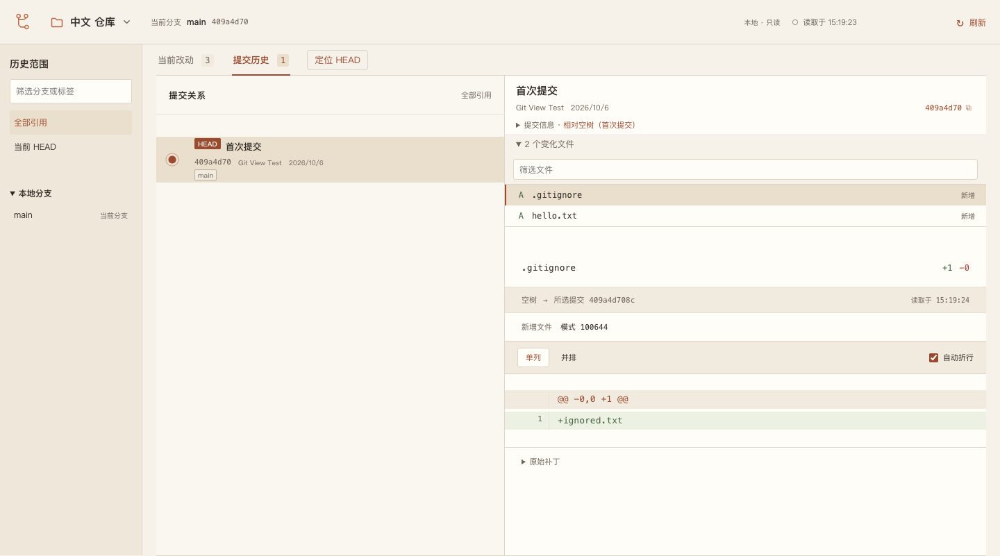
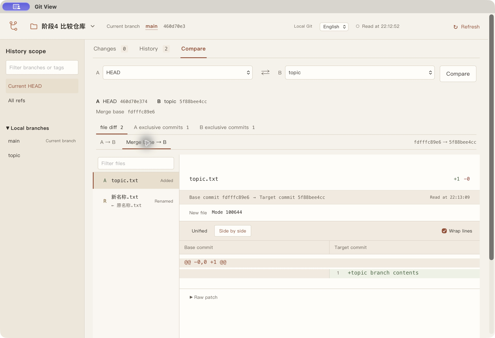

# Git View

[](https://github.com/XSY-28/git-view/actions/workflows/check.yml) · [MIT License](LICENSE)

Git View 是一个本地 Git 图形工具。它把 HEAD、暂存区和工作区的比较分开显示，也能沿提交关系查看历史、比较分支或提交。你可以在同一窗口里读差异、按文件暂存、提交，以及创建或切换本地分支；写入前先预览、再确认。

例如，同一个文件已经暂存后又被修改，**Changes（当前改动）** 会分别显示“已暂存”和“未暂存”的差异。切到 **History（提交历史）**，点击一个提交，就能查看它相对父提交改了哪些文件。选择侧栏的分支或标签只改变历史范围，不会切换当前分支。



界面默认英文，顶部可切换为中文并保存选择。仓库名、路径、提交说明、文件内容和 Git 诊断保留原文。仓库由本机 Git 读取，无需远程服务。

当前为桌面预览版。下面的安装和操作流程面向 **macOS Apple silicon**；Windows 暂时只开放查看。

## 安装并打开一个仓库

先准备 Git、Node.js **24.19.0**、pnpm **11.7.0**、Rust 和 Xcode Command Line Tools；CI 使用 Rust 1.99.0。

在终端克隆项目，后续命令都在 `git-view` 项目根目录执行：

```sh
git clone https://github.com/XSY-28/git-view.git
cd git-view
pnpm install --frozen-lockfile
pnpm build
pnpm build:desktop
pnpm install:desktop --dry-run
pnpm install:desktop
open "$HOME/Applications/Git View.app"
```

`--dry-run` 检查构建与安装状态；下一条命令才安装应用。安装位置固定为 `~/Applications/Git View.app`，旧安装保存为 ZIP；安装成功后移除本次构建副本、清理失效的 Git View 注册记录并刷新搜索服务。备份与恢复机制见[安装说明](docs/verification/2026-10-06-desktop-install.md)。

以后更新源码后，先退出 Git View，在项目根目录执行以下命令，一次完成构建和安装；应用仍在运行时，更新命令会在构建前停止并提示退出：

```sh
pnpm update:desktop
open "$HOME/Applications/Git View.app"
```

如果已有安装在 Spotlight 中重复显示，可先运行 `pnpm repair:desktop-search --dry-run` 检查，再运行 `pnpm repair:desktop-search`。它不需要重新构建或替换应用，会清理失效注册并重启当前用户的搜索服务；遇到其他仍存在的 Git View 副本会报告路径并停止。命令核实的是注册与进程状态，重复入口是否消失仍需在 Spotlight 中重新搜索确认。

打开应用后，按 `⌘O` 或点击顶部 **Open repository…（打开仓库…）**，选择一个本地 Git 仓库。也可以展开仓库切换器，在 **Enter path manually（手动输入路径）** 中填写绝对路径。

默认进入当前改动视图。点击文件查看差异；同一文件的已暂存和未暂存条目分别比较 HEAD → 暂存区、暂存区 → 工作区。差异可切换单列或并排，并选择是否折行。按 `⌘R` 手动刷新，仓库文件变化也会触发更新。

安装后的应用自带 Node 运行时，仍需系统 Git；运行时不需要另装 Node、Rust 或 Swift。当前为未公证的本地构建包。

## 用一个示例看懂两份差异

如果没有合适的仓库，可以在上述项目根目录运行：

```sh
node scripts/create-demo.mjs
```

脚本在临时目录创建演示仓库，并输出它的绝对路径，不修改你已有的仓库。把该路径填入 Git View 的手动路径入口并打开。

演示仓库中的 `hello.txt` 有三个版本：HEAD 已提交 `version one`，暂存区是 `version two staged`，工作文件又改成了 `version three working`。当前改动视图应显示：

| 条目 | 点击后看到的比较 |
| --- | --- |
| 已暂存的 `hello.txt` | `version one` → `version two staged` |
| 未暂存的 `hello.txt` | `version two staged` → `version three working` |
| 未跟踪的 `尚未跟踪.txt` | 文件的文本预览 |

在 macOS 上，可以继续试一次完整操作：

1. 勾选未暂存的 `hello.txt`，点击 **Preview Stage（预览暂存）**。预览核对的是暂存区第二版 → 工作区第三版。
2. 确认后，暂存区变成第三版，工作文件保持第三版；未暂存列表中的该文件消失。另一份未跟踪文件不会被暂存。
3. 在已暂存列表勾选 `hello.txt`，点击 **Preview Unstage（预览取消暂存）** 并确认。暂存区恢复为 HEAD 的第一版，工作文件仍是第三版。

这里的暂存和取消暂存都操作**整个选定文件**，不支持按差异行或片段操作。只点击文件是查看，勾选才加入操作范围；关闭预览不会执行写入。

## 提交、分支和历史怎么用

在当前改动视图点击 **Commit…（提交…）**，填写说明，核对已暂存文件后确认。提交只使用暂存区内容，不会顺便暂存其他修改。提交和切换分支会保留 Git hooks 与已配置签名程序，确认页会要求明确允许运行。

顶部的当前分支名称是分支操作入口。创建分支从预览时的 HEAD 出发，创建后仍留在原分支；切换分支需要另行操作，只能切换到已有本地分支，并要求工作区没有暂存、未暂存或未跟踪改动。应用不会自动 stash。

侧栏的 **History scope（历史范围）** 用于阅读历史。默认从当前 HEAD 出发，也可选择某个分支、标签或全部引用；全部引用提供时间优先与分支聚合两种排序。点击提交打开详情，按 Esc 返回列表，选择和纵向位置会保留。历史按 200 条加载，可以继续翻页或定位 HEAD。

首次提交与空树比较，合并提交默认与第一父提交比较。文件读取失败或取消时保留上次结果，可以重试。预览后仓库状态改变，会要求重新预览；如果执行响应丢失，应用先核实已有回执，不自动重复写入。原生界面与操作恢复的验证范围见[验证记录](docs/verification/v0.2-a.md)、[暂存验证](docs/verification/2026-10-06-stage-files.md)和[提交与分支验证](docs/verification/2026-10-06-commit-branches.md)。

## 比较两个分支或提交

假设 `main` 和 `topic` 从同一提交分出，之后两边都有新的提交。切到 **Compare（版本比较）**，在 A 选择 `main`、B 选择 `topic`，点击 **Compare（比较）**。应用显示解析后的提交 ID、共同祖先，以及 **A exclusive commits / B exclusive commits（两侧独有提交）**；点击独有提交可以查看其详情，不会切换分支。

文件差异提供两个不同的比较基准：

| 基准 | 在这个例子中回答的问题 |
| --- | --- |
| **A → B** | `main` 和 `topic` 的文件最终有什么不同？比较两端提交的树，包含两边各自改动带来的差异。 |
| **Merge base → B（共同祖先 → B）** | 从共同祖先到 `topic`，文件变成了什么样？比较共同祖先的树与 B 的树。 |



A/B 也可以选择 HEAD、标签、已有远程跟踪引用或完整/短提交 ID。每次比较显示实际解析的提交 ID，后续分页基于同一对端点读取；刷新或重新比较会创建新的结果。交换 A/B 会重新比较，文件列表支持新旧路径筛选、键盘导航和单列/并排差异。

只有能确定唯一共同祖先时，才启用共同祖先 → B 模式。浅历史会明确标注计数不完整；没有共同祖先或存在多个共同祖先时，不会任意选择一个基准，但仍可比较本机已有的 A/B 提交树。该视图只读取已存储的 Git 对象，不把工作区改动混入比较，也不联网获取缺失对象。设计与验证范围见[比较设计](docs/decisions/0003-revision-comparison.md)和[版本比较验证](docs/verification/2026-10-06-revision-comparison.md)。

## 使用前需要知道的限制

| 平台 | 当前验证与支持范围 |
| --- | --- |
| macOS Apple silicon | 查看、版本比较、暂存、提交、本地分支及安装副本已有实机验证；CI 覆盖源码、Rust 宿主、安装流程与浏览器回归。 |
| Windows | CI 检查核心 Git 读取、stdio 与桌面宿主；写入未开放，版本比较的原生界面与安装尚未实机验证。 |

- 暂不提供 push、merge、rebase 或历史重写。远程跟踪引用来自本地仓库，不会自动获取远端更新。
- 二进制、非 UTF-8、超过 1 MiB 或 10,000 行的内容不展开文本预览。没有文本预览不代表文件没有变化。
- 不支持裸仓库、partial clone/promisor 仓库；涉及外部 clean/process 过滤器时不扫描工作区，不会为读取自动下载对象。
- 写入目前限于常规仓库和 index。冲突、进行中的 Git 操作、submodule、特殊 index 或外部内容过滤器会被拒绝；整文件暂存暂不支持 `text`、`eol`、`ident`、`working-tree-encoding` 和 autocrlf 转换。操作边界详见上述暂存及提交验证文档。

## 其他入口与开发

<details>
<summary>浏览器备用入口（macOS）</summary>

在项目根目录完成 `pnpm install --frozen-lockfile` 和 `pnpm build` 后，用下面的命令打开另一个仓库；将示例路径替换成实际的绝对路径：

```sh
node dist/cli.mjs open --repo "/absolute/path/to/your/repository" --json
```

页面沿用上述查看与操作流程。`pnpm open` 则打开当前项目根目录这个仓库。进程只监听 `127.0.0.1`，需要本机 Node 24 和浏览器，不依赖开发服务器。更新构建后先执行 `pnpm stop`，再重新打开。

仅查询概览而不打开窗口：

```sh
node dist/cli.mjs inspect --repo "/absolute/path/to/your/repository" --json
```

返回带观测时间的 JSON 概览，不包含源码或完整差异。桌面安装包另有不依赖外部 Node 的 CLI，命令与 Codex skill 安装方法见[本地入口说明](integrations/codex/README.md)。

</details>

语言设置、最近仓库与运行信息默认保存在 `~/.local/share/git-view`。可用 `GIT_VIEW_HOME` 指定另一目录；语言选择是应用级设置，不属于某个仓库。

修改源码后，在项目根目录运行：

```sh
pnpm check                     # 类型检查、源码测试与构建
pnpm exec playwright install chrome
pnpm test:e2e                  # 界面回归
pnpm test:install-desktop      # macOS 安装与恢复测试
```

测试写入使用新建的临时仓库。源码检查和手动桌面验收各有范围，CI 通过不等于所有平台的原生界面已验收。模块职责见[实现基线](docs/decisions/0001-implementation-baseline.md)、[桌面架构](docs/decisions/0002-desktop-host.md)和[版本比较设计](docs/decisions/0003-revision-comparison.md)，语言默认值与持久化行为见[语言验证](docs/verification/2026-10-06-language.md)。

欢迎通过 [Issues](https://github.com/XSY-28/git-view/issues) 报告问题或提交 Pull Request。请提供平台、版本、复现步骤和预期结果，并移除日志或截图中的私人信息。

源码采用 [MIT 许可证](LICENSE)。桌面包随附 [Node.js 运行时许可](apps/desktop/licenses/node-v24.19.0-LICENSE)，第三方依赖保留各自许可证。
