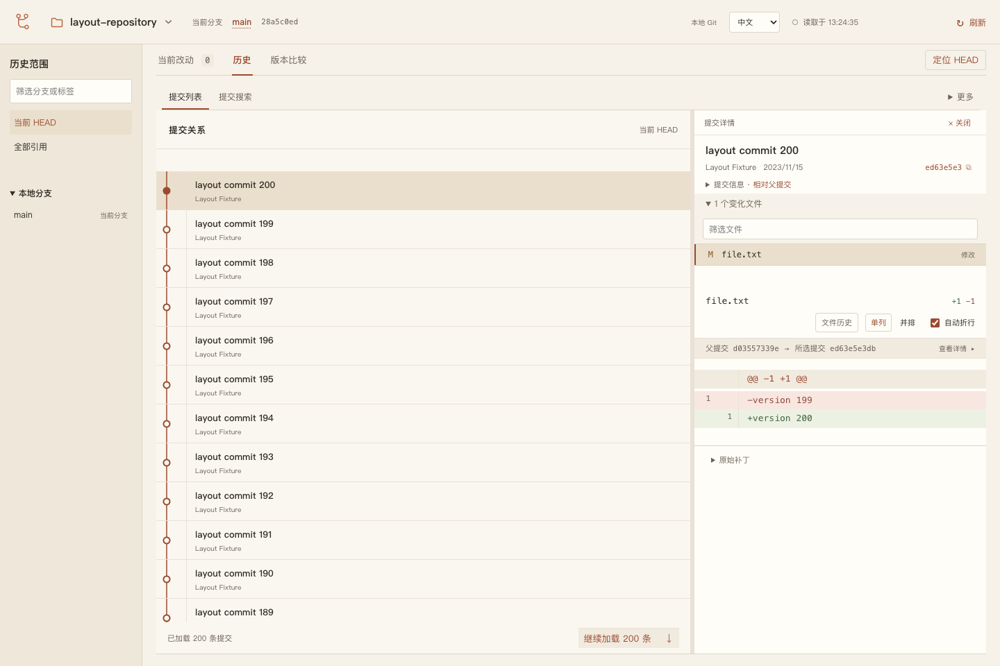

# Git View

[](https://github.com/XSY-28/git-view/actions/workflows/check.yml) · [MIT License](LICENSE)

Git View 是一个本地 Git 图形工具，用于查看文件差异、浏览提交历史，以及比较分支和提交。支持整文件暂存、提交和本地分支操作，写入前需要预览确认。

支持中文和英文界面，通过本机 Git 读取仓库，无需连接远程服务。目前为桌面预览版，提供 macOS Apple silicon 和 Windows x64 安装包；Windows 暂时只开放查看。



## 功能

| 视图 | 功能 |
| --- | --- |
| 当前改动 | 分开查看已暂存、未暂存改动和未跟踪文件；差异支持单列、并排和折行。 |
| 历史 | 浏览提交关系图，按分支或标签筛选，查看每次提交的文件差异。 |
| 版本比较 | 比较两个分支、标签或提交，查看两侧独有提交；可选择两端直接比较或从共同祖先比较到 B。 |
| 历史查询 | 按提交标题、作者、提交 ID 或文件路径搜索；查看文件历史、行来源（git blame）、stash 和 reflog。 |
| 仓库操作 | 按文件暂存或取消暂存，提交已暂存内容，创建和切换本地分支。 |

在历史侧栏选择分支只会筛选历史。创建或切换分支使用顶部的当前分支入口；创建后仍留在原分支，切换要求工作区干净。

## 安装

在 [GitHub Releases](https://github.com/XSY-28/git-view/releases/latest) 下载当前版本的安装包和 `.sha256` 校验文件，无需登录 GitHub。两种包都自带 Node 运行时，使用时只需系统 Git，无需另装 Node、pnpm 或 Rust。

- **macOS Apple silicon**：下载 `macos-arm64.dmg`，打开后先退出 Git View，再双击 **Install Git View.command**。安装位置固定为 `~/Applications/Git View.app`，旧版本保留为 ZIP；完成后弹出磁盘映像。不要再复制一份到 `/Applications`。
- **Windows x64**：下载 `windows-x64-setup.exe`，运行安装向导，再从开始菜单打开。需要 Git for Windows 与 WebView2；缺少 WebView2 时安装程序会下载运行时。Windows 仅支持查看，不开放暂存、提交和分支写入。

当前包尚未代码签名或 Apple 公证，系统可能提示无法验证发布者。确认下载来源后，使用系统提供的“仍要运行”或“隐私与安全性 → 仍要打开”入口，不要关闭系统安全机制。完整步骤与校验、卸载说明见[安装包说明](docs/INSTALL.md)。

### 从源码构建（macOS）

构建需要 Git、Node.js **24.19.0**、pnpm **11.7.0**、Rust 和 Xcode Command Line Tools。CI 使用 Rust 1.99.0。

先退出正在运行的 Git View，然后执行：

```sh
git clone https://github.com/XSY-28/git-view.git
cd git-view
pnpm install --frozen-lockfile
pnpm build
pnpm build:desktop
pnpm install:desktop --dry-run
pnpm install:desktop
open "$HOME/Applications/Git View.app"
```

`--dry-run` 只检查安装条件。应用固定安装到 `~/Applications/Git View.app`，旧版本保存为 ZIP；安装器会清理本次构建副本。

安装后的应用自带 Node 运行时，仍需系统 Git。运行应用不需要另装 Node、Rust 或 Swift。

> ⚠️ 桌面包目前未公证。

打开应用后，按 `⌘O` 或点击 **打开仓库… / Open repository…**，选择本地 Git 仓库。也可以在仓库切换器中手动输入绝对路径。

点击文件查看差异，勾选文件后才会加入暂存操作的范围。已暂存改动比较 HEAD 与暂存区，未暂存改动比较暂存区与工作文件。提交只使用暂存区内容。

<details>
<summary>演示仓库</summary>

在项目根目录运行：

```sh
node scripts/create-demo.mjs
```

脚本在临时目录创建仓库并输出绝对路径，不修改已有仓库。将输出路径填入应用的手动路径入口即可打开。

演示中的 `hello.txt` 已暂存后又被修改，因此会同时出现在已暂存和未暂存列表中，两项分别显示各自的差异。

</details>

## 更新

安装包用户退出 Git View 后，下载新版本并重新安装即可。macOS 会将旧版本备份为 ZIP。

从源码更新的 macOS 用户退出 Git View 后，在项目根目录运行：

```sh
pnpm update:desktop
open "$HOME/Applications/Git View.app"
```

`update:desktop` 完成构建和安装；如果已经构建，可使用 `pnpm install:desktop`。备份恢复及 Spotlight 重复入口的处理见[桌面安装说明](docs/verification/2026-10-06-desktop-install.md)。

## 支持范围

macOS Apple silicon 已有桌面实机验证。Windows 暂时仅开放查看，已通过 Windows CI 中的实际安装、原生窗口差异与历史走查、正常退出和卸载验证；Windows 10/11 实体电脑尚未复测。详见[安装包验收记录](docs/verification/2026-10-07-desktop-installers.md)。

- 暂不提供 push、merge、rebase 或历史重写。远程跟踪引用来自本地仓库，不会自动获取远端更新。
- 暂存按整个文件操作，不支持选择差异行或片段。写入限常规仓库和 index；冲突、进行中的 Git 操作、submodule、特殊 index 或外部内容过滤器会被拒绝。暂不支持 `text`、`eol`、`ident`、`working-tree-encoding` 和 autocrlf 转换。
- 提交保留仓库的 hooks 和签名设置，切换分支会运行已配置的 hook；确认页会要求授权。预览后仓库状态改变时，需要重新预览。
- 二进制、非 UTF-8、超过 1 MiB 或 10,000 行的内容不展开文本预览。不支持裸仓库、partial clone/promisor 仓库；使用外部 clean/process 过滤器时不扫描工作区。

文件历史沿第一父链追踪普通重命名，行来源对应已提交版本。reflog 仅支持 files 引用存储；stash 和 reflog 提供查看，不提供恢复或删除操作。共同祖先比较要求能确定唯一共同祖先。

具体边界与验证结果见[暂存](docs/verification/2026-10-06-stage-files.md)、[提交与分支](docs/verification/2026-10-06-commit-branches.md)、[版本比较](docs/verification/2026-10-06-revision-comparison.md)和[历史查询](docs/verification/2026-10-07-history-investigation.md)文档。CI 通过不代表所有平台的原生界面都已验收。

## 浏览器与 CLI

macOS 上也可以使用浏览器入口。它需要本机 Node.js 24、Git 和浏览器；在项目根目录安装依赖并执行 `pnpm build` 后运行：

```sh
node dist/cli.mjs open --repo "/absolute/path/to/your/repository" --json
```

将路径替换为实际仓库的绝对路径。`pnpm open` 打开当前项目仓库；服务只监听 `127.0.0.1`。更新构建后先执行 `pnpm stop`，再重新打开。

只查询仓库概览：

```sh
node dist/cli.mjs inspect --repo "/absolute/path/to/your/repository" --json
```

桌面 CLI 和 Codex 接入见[本地入口说明](integrations/codex/README.md)。语言设置、最近仓库和运行信息默认保存在 `~/.local/share/git-view`，可用 `GIT_VIEW_HOME` 指定其他目录。

## 开发

在项目根目录安装依赖后运行：

```sh
pnpm check
pnpm exec playwright install chrome
pnpm test:e2e
pnpm test:install-desktop
```

`pnpm check` 包含编号副本检查、类型检查、源码测试和构建。安装测试适用于 macOS；测试仓库使用临时目录，系统注册与搜索服务操作使用替身。

桌面开发使用上述 `pnpm update:desktop` 安装，并从固定路径打开应用。CI 或仅生成发布包时使用 `pnpm build:desktop`。

实现说明见[核心架构](docs/decisions/0001-implementation-baseline.md)、[桌面宿主](docs/decisions/0002-desktop-host.md)和[维护约定](docs/decisions/0005-maintenance-contracts.md)。

欢迎通过 [Issues](https://github.com/XSY-28/git-view/issues) 报告问题，或提交 Pull Request。问题报告请包含平台、版本、复现步骤和预期结果，日志与截图中请移除私人信息。

## 许可证

[MIT](LICENSE)。桌面包随附 [Node.js 运行时许可](apps/desktop/licenses/node-v24.19.0-LICENSE)，第三方依赖保留各自许可证。
