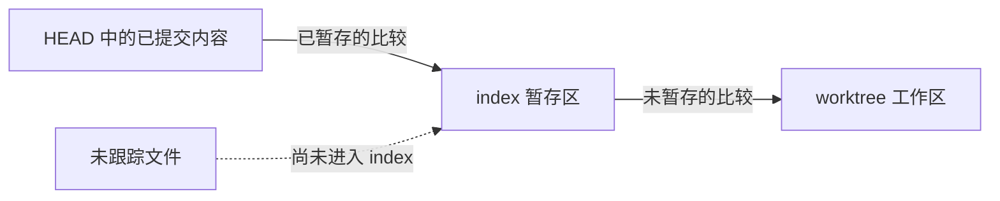
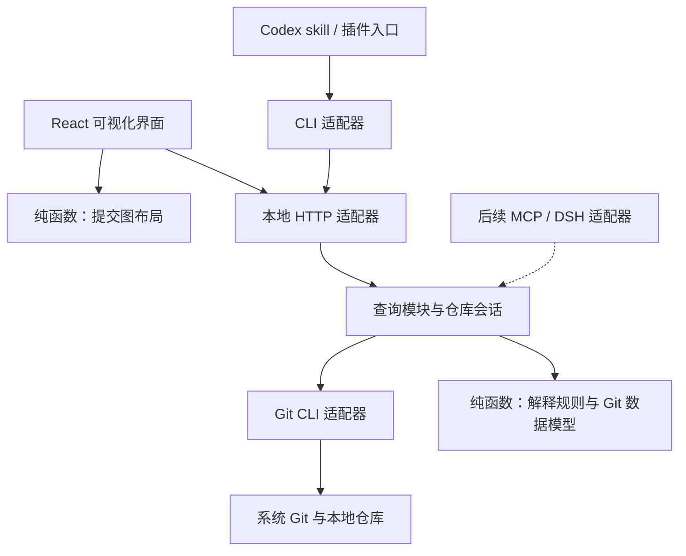

# Git 可视化工具：MVP 开工文档

文档版本：0.6 · 初稿日期：2026-10-05 · 产品方向与界面约定更新：2026-10-06。状态：首轮 MVP 功能已实现，完整验收仍有缺口；后续两个产品阶段按第 13 节的新计划推进，现有界面的三轮优化单独跟踪。

**当前适用范围：** 2026-10-06 用户要求移除新手引导，以日常 Git 工具为产品定位。F05 固定问答、教学解释区及相关教学验收不再是要求；界面只保留仓库状态、比较基准、来源、限制和错误等操作所需信息。原有 `explanations` 数据契约与核心规则暂保留兼容，文中相关架构记录不代表应恢复教学界面。历史验收记录保持原样。

本文面向项目开发者及参与施工的 AI。没有阅读过讨论记录，也应能据此判断：第一版做什么、怎样拆分代码、先交付什么、什么证据可以证明完成。

**产品目标：提供本地 Git 可视化工具，准确、高效地查看工作区、暂存区、提交历史和仓库引用。**

**首版交付：一个本地、只读的 Git 可视化工具，以及一个 Codex 轻量入口。共享同一套 Git 事实和查询核心。**

这里的“当前变化”指工作区、暂存区与已提交历史中的事实。首版不记录任务起点，不承诺识别“这次 AI 独自产生的修改”。

阅读顺序：第 1–5 节确定产品和验收范围；第 6–10 节确定架构及演进方式；第 11–13 节安排施工与验证；附录保存研究依据。

当前后续施工入口：[第二、第三阶段实施计划](superpowers/plans/2026-10-06-next-stages.md)。该计划整合 oil-git 的查看体验和桌面交付经验，按“查看与比较 → 基础 Git 操作”推进；其中未实现的功能不计入当前 MVP 完成情况。

现有查看器同时按 [三轮界面优化计划](superpowers/plans/2026-10-06-interface-refinement.md) 调整。界面三轮已实现入口合并和布局压缩、差异呈现和文件导航、刷新与反馈统一。这些轮次不代表产品 2B 或第三阶段已开始，当前界面以第 5 节及 [第三轮验收记录](verification/2026-10-06-interface-round3.md) 为准。

## 1. 决策、默认值与假设

| 类型 | 内容 | 如何处理 |
| --- | --- | --- |
| 已确认方向 | 日常 Git 工具；查看真实仓库；只读 MVP；共享核心；先接一个 harness；后续支持 DSH | 纳入首版范围，不在施工中自行扩大 |
| 本文推荐默认值 | 首个宿主为本地 Codex；中文界面；macOS Apple silicon 为首个验收平台；Node.js + TypeScript 本地进程、React 浏览器界面 | 可开始施工；更换方案时写清触发原因、影响和验证方法 |
| 待验证假设 | 用户会在编辑后主动查看；连续的导航与比较流程、轻量接入能减少使用阻力 | 用真实任务和试用反馈验证，不写成市场事实 |
| 当前验收缺口 | 部分兼容/竞态场景、冷缓存测量、全局 Codex skill 发现与触发、真实用户试用等 | 已完成实现与实测见 verification；本文仍是验收约定，不因开始后续阶段而自动勾选旧缺口 |

原理是：Git 保存提交及引用，暂存区决定普通提交的候选内容，工作区保存正在编辑的文件。产品应准确呈现这些对象及其比较关系。harness 是使用入口；它不替代 Git 事实来源。

改动清单展示相对基准发生的变化；Git 提交仍记录项目的一份树快照，不能把清单解释成“提交只保存这些文件”。

MVP 必须是一条可用的完整流程。基础查看和 Codex 入口都要交付；不能只完成一个图形页面就声称 MVP 完成。

## 2. 用户与核心流程

### 2.1 首批用户

使用终端、编辑器或 Codex 等工具开发本地项目，需要查看变化和调查历史的开发者。用户已有本地仓库及系统 Git。

独立使用也必须成立。用户在终端或编辑器修改文件后，可以直接打开工具；不要求登录、API Key 或 AI 会话。

### 2.2 一条可演示的完整流程

1. 用户在 Codex 中完成一次代码修改，请它“打开 Git 变化视图”；也可以从终端启动工具并指定仓库。
2. 工具定位当前会话实际使用的 worktree，展示路径、当前分支和 HEAD。
3. 用户看到“已暂存”“未暂存”“未跟踪”三组内容，点击文件查看相应比较。
4. 同一文件既有已暂存内容、又有后续修改时，界面保留两份比较及各自基准。
5. 用户在已暂存与未暂存列表中选择文件，查看对应 diff。
6. 用户查看提交图，定位 HEAD，点击最近提交了解已提交内容。
7. 用户在外部终端或编辑器继续操作，回到工具刷新；界面更新且尽量保留仍有效的选择。

Codex 入口可以打开宿主浏览器或系统浏览器。首版不要求在聊天区域嵌入完整交互界面。

### 2.3 必须准确呈现的状态

- 当前分支、HEAD、detached HEAD 或尚无首次提交的状态。
- 已暂存、未暂存、未跟踪内容及各自比较基准。
- 冲突、进行中的操作、读取失败和信息不完整状态。

这些信息通过状态栏、列表和 diff 呈现，不设置固定问答面板。遇到冲突、读取失败或信息不完整时显示具体限制。

## 3. MVP 功能范围

以下保留首版功能编号；F05 的教学界面要求已撤销，其余各项仍有对应施工任务和验收场景。

| 编号 | 必做功能 | 用户可检查的完成标准 |
| --- | --- | --- |
| F01 | 打开本地仓库与最近使用列表 | 接受根目录或其子目录，显示解析后的 worktree 路径；可切换仓库；不存在的路径、非仓库路径有明确提示；最近记录仅保存在本机 |
| F02 | 展示当前分支、HEAD 和特殊状态 | 区分正常分支、detached HEAD、尚无提交；未解决冲突和进行中的合并、变基等操作有状态提示；不把未知状态显示为正常 |
| F03 | 三组改动与按需 diff | 区分 HEAD→index、index→worktree、未跟踪文件；同一文件可出现在两个组；支持普通 UTF-8 文本的新增、修改、删除及 Git 已识别的重命名 |
| F04 | 基础提交图与提交详情 | 展示提交父子关系、HEAD、分支和标签；首批 200 条，可继续加载；点击提交查看文件列表及相对父提交的 diff；提供“定位 HEAD” |
| F05 | 原固定问题解释（界面要求已撤销） | 不再展示固定问答和教学提示；已有数据契约为兼容保留，Git 事实仍由确定性核心产生 |
| F06 | 刷新、取消和错误恢复 | 支持手动刷新、窗口重新获得焦点时刷新；显示最近成功读取时间；过期请求的成功和失败都不覆盖当前视图；失败可显式重试 |
| F07 | Codex 轻量接入 | 提供可安装到本地 Codex 的 skill/插件包，调用同一 CLI；能打开正确 worktree 的变化视图，并返回有时间标记的结构化概览；不依赖开发服务器 |

补充约定：

- 文件列表是观测结果，不是可操作的暂存清单。首版不提供暂存、撤销、提交按钮。
- 未跟踪文件按“尚未纳入 Git”展示，文本预览与“已暂存 diff”使用不同标签；尊重忽略规则。
- 首次提交相对空树展示；合并提交默认相对第一父提交，必须显示比较基准，不把它称作“合并全部变化”。
- 图的连线表示提交父子关系。分支标签指向提交，不把某条彩色线永久解释为某个分支。
- 初始历史包含本地分支、标签、已存在的远程跟踪引用和当前 HEAD 可达的提交；不 fetch。分页以本次读取固定的引用 tip 为起点，刷新后重新建分页游标。
- 图中尚未加载的父提交显示延续标记；浅克隆缺少的历史显示边界，不能伪装成真实根提交。
- HEAD 在已加载列表中时显示“定位 HEAD”，选择对应提交；未加载时按钮改为“查看 HEAD 历史”，点击后切换到以当前 HEAD 为起点的历史窗口，并显示范围变化。
- 首屏内容较多时先让当前改动可用，再加载历史。提交图不得阻塞查看 diff。
- 没有未提交变化时显示工作区干净状态，保留查看最近提交的入口；不能据此推断 AI 没有修改过项目。

## 4. 明确后置的功能与边界

### 4.1 不进入 MVP

任务前后基线比较、自动记录操作时间线、完整文件历史搜索、分支之间的任意比较、blame、交互式 rebase、冲突解决器、stash 管理、Git 写操作、DSH 正式适配、多 agent 归因、GitHub PR 管理、账户与云同步、内置 AI 聊天、自动生成提交说明、移动端、插件市场上架。

这些功能不进入原始 MVP；其中任务比较、文件历史、分支比较、基础操作等后续排期现由[两个阶段实施计划](superpowers/plans/2026-10-06-next-stages.md)明确。吸收参考项目的具体能力时仍按用户问题、依赖和验收拆分，不把所有增强一次性塞入同一交付。

尤其不得在首版“顺便”执行 fetch、stash、建立备份提交、修复 Git 配置或初始化用户仓库。

### 4.2 必须正确处理或明确降级的情况

| 情况 | MVP 行为 |
| --- | --- |
| 部分暂存后再次修改 | 分别展示 HEAD→index 与 index→worktree 两份 diff |
| 同一仓库存在多个 worktree | 使用实际 worktree 路径分别建立会话、选择和缓存，不混用 index 与 HEAD |
| 未解决冲突或操作进行中 | 明确列出冲突及已识别的操作状态；不提供正常提交预测；不实现解决或继续操作 |
| 空仓库、detached HEAD | 分别展示“尚无提交”“当前直接指向提交”；不伪造分支名或空提交 |
| 二进制、超大 diff、非 UTF-8 内容 | 显示类型、可用统计及不展开原因，不乱码、不假装空 diff；默认单份文本预览上限 1 MiB 或 10,000 行，先达到者生效 |
| Git LFS、submodule | 可展示提交/index 中已有的指针或 gitlink；注明未展开实际对象或嵌套仓库；依赖过滤器的工作区读取按下一行降级；不下载 LFS、不递归操作子模块 |
| 工作区读取需要外部 clean/process filter | 不运行过滤器；相应概览标为不完整，保留可安全读取的 index 与提交对象，解释不支持原因；不能静默禁用转换后把非等价结果当作正常 Git 状态 |
| 中文、空格、制表符、换行或以 `-` 开头的路径 | 作为路径处理，不分裂记录、不当选项；非 UTF-8 路径以转义名称显示并禁止不可靠的详情操作 |
| 符号链接 | 展示链接本身的变化，不沿链接读取仓库外目标内容 |
| 裸仓库、远程运行的仓库 | 返回明确的不支持说明；首版只承诺本机有工作区的仓库 |
| 浅克隆或缺失对象 | 展示历史边界或缺失原因；不隐式联网补齐；无法可靠阻止隐式抓取的运行环境拒绝该详情查询 |
| Git 未安装、权限不足、Git 拒绝信任目录 | 给出具体原因和人工处理入口；不自动改全局配置或绕过 Git 检查 |
| 文件持续变化、锁冲突、仓库被删除 | 提示读取失败或正在变化，保留旧结果并标为过期；不显示“没有修改” |

本节规定的是降级行为，并不要求首版深入支持所有 Git 工作流。

## 5. 界面与交互约定

### 5.1 主界面

顶部采用紧凑工具栏，保留仓库切换器、当前分支/HEAD、最近读取时间、刷新和一个只读标记。仓库名称是切换器的入口，内部集中放置“打开仓库…”、最近仓库、同仓库的多个 worktree、完整路径及复制、手动路径；不在侧栏重复这些入口，`⌘/Ctrl+O` 仍可直接调用原生文件夹选择。

常驻侧栏只负责“历史范围”，包含全部引用、HEAD、本地分支、标签、已有远程跟踪引用及筛选。当前分支有独立标记；选择某条引用只改变历史查询，不切换实际分支或 worktree。主体分为“当前改动”和“提交历史”两个视图：

- 当前改动：文件列表与 diff 两个面板；不设置教学解释区。
- 提交历史：左侧提交图与列表，右侧展示紧凑提交摘要及文件 diff。标题、作者、日期、短 ID 和比较语义默认可见；完整 ID、时间、父提交、完整比较基准按需展开，提交 ID 可复制。变化文件列表默认展开，可收起，长列表独立滚动。
- 窄窗口按顺序切换区域，不把所有面板强行挤在一屏。

界面第一轮调整信息层级与入口；第二轮调整差异呈现及文件键盘操作/过滤，第三轮统一刷新与取消。各轮都保留必要的失败、过期和不完整提示。

刷新按钮始终表示重新读取仓库。已有结果的短暂读取只显示轻量进度，超过 800 毫秒再提供具名取消入口；首次读取立即显示进度。取消是中性状态，保留结果并提供重新读取；失败显示错误与重试，旧结果明确标记。取消同时清除排队刷新，单纯聚焦窗口不会立即重启已取消的读取；手动刷新或新的仓库变化可恢复更新。同一提交重试保留所选文件、展开状态及阅读位置。提示时长集中在 `features/feedback`，父子取消关系由 `state/read-coordination` 管理。

开发时按如下关系核对比较语义；界面展示对应基准标签，不展示概念教程：



图中的箭头表示比较关系，不表示软件正在移动文件或执行命令。

### 5.2 比较结果的最低信息

显示所选文件或提交、比较两端、观测时间以及读取限制。状态与 diff 使用同一观测身份；结果过期时明确标记并重新读取，不能用当前内容冒充旧观测。

差异正文默认省略重复的 Git 补丁头，保留变化区段、真实行号、未换行标记及路径/模式变化。原始补丁按需展开查看或复制；不完整结果明确标识已获取部分。差异提供“单列／并排”显示，表头使用实际比较对象；未跟踪文本固定为单列预览，仅提供适用的折行控件。

### 5.3 可用性底线

颜色之外保留文字、图标或线型区分。文件列表、提交列表和主要操作可用键盘访问。加载、空状态、部分结果、失败各有独立表示。复制路径、查看完整提交 ID 属于展示操作，可以提供。

当前改动和提交文件可按新旧路径筛选，筛选词按 worktree 与视图分别保存。当前项仍匹配时保留选择；被筛掉时取消详情读取并清空选中，清除筛选不自动跳选。上下方向键及 Home/End 在可见、可读取的条目之间移动，并保持焦点和所选行可见；键盘移动不将窄窗口切到隐藏列表的详情面板。

## 6. 架构选择：一套核心，多种入口

不存在能预先适应所有需求的架构。这里的目标是：**把容易变化的部分隔开，让一次需求变化尽量集中在少数模块，并能通过测试发现语义是否改变。**

### 6.1 两个可行方案

| 方案 | 组成 | 优点 | 代价与适用条件 |
| --- | --- | --- | --- |
| A：TypeScript 本地模块化单体，推荐 | Node.js 本地进程 + React 浏览器界面 + CLI；之后增加 MCP 与宿主适配器 | 首版一种主要语言；CLI 和页面共享核心；容易在无界面环境验证；接 Codex 和 DSH 的成本集中在入口 | 需要处理本地进程生命周期和回环 HTTP；首版不是原生桌面窗口。适合当前小团队、快速验证用途 |
| B：Rust 核心 + Tauri 桌面壳 | Rust Git/查询模块 + IPC + Web 界面 + CLI/MCP 入口 | 可统一管理本机能力、打包和后台工作；适合明确需要桌面产品形态的路线 | Rust/TypeScript 两种语言、跨语言契约和桌面发布增加成本；采用它不会自动解决状态一致性或 Git 语义问题 |

**采用 A 作为施工默认值。** B 保留为替代路线，不同时实现两个后端。只有测量证明核心执行成本成为瓶颈，或目标用户明确要求桌面分发且收益覆盖迁移成本，才重新评估 B。

若只是需要原生窗口，可先评估在 A 外增加桌面壳；这与把核心改写成 Rust 是两个独立决定。迁移到 B 时可复用数据契约、界面和真实仓库测试场景，不能假定 TypeScript 核心代码能直接复用。

后续路线更新：第二阶段将验证 A 外增加 Tauri 薄壳与随包 Node 子进程，具体门槛见新计划 2A-01；这不等同于已经选择 B 的 Rust 核心迁移。

### 6.2 推荐技术默认值

- 语言与运行时：TypeScript 严格模式、Node.js 24 LTS；当前官方版本表将 24 列为 LTS。[Node.js 版本表](https://nodejs.org/en/about/previous-releases)
- 界面：React、Vite；提交图先采用虚拟列表配 SVG，布局算法为纯函数；没有性能证据前不引入复杂图形引擎。
- Git：调用系统 Git CLI。先集中解析和能力检测；不同时引入多个 Git 引擎。
- 工程：pnpm workspace；纯逻辑和集成验证使用 Vitest，界面流程使用 Playwright。
- 存储：最近仓库、偏好和运行时发现信息保存到本机应用数据目录；MVP 不需要数据库，也不持久保存仓库源码。
- 版本：M0 固定实际验证过的依赖版本和 lockfile，记录 Node、Git、浏览器、Codex 版本。最低 Git 支持版本由能力检查及真实测试确定，不凭推测宣称兼容。

这些是首版选型约定；当前实际安装和经过验证的版本见 README 与 verification，不能将一次本机验证推广为全部平台兼容。

### 6.3 模块与依赖方向



这是一个代码仓库中的模块化单体。浏览器、Node 和 Git 子进程因运行环境而分开，不代表需要微服务、远端服务器或消息队列。

依赖规则：

1. Git 数据模型、解释规则、图布局不得依赖 React、Codex、DSH、HTTP 或进程启动。
2. 界面只消费结构化数据，不能自己拼 Git 命令或解析 Git 文本。
3. CLI、HTTP、未来 MCP 负责输入验证、调用与结果编码；同一问题的解释逻辑只实现一次。
4. Git 适配器负责进程、参数、字节解析及 Git 特有兼容；不能持有“当前选中哪个面板”等界面状态。
5. 通过明确的查询函数协作，不引入可任意调用任意模块的全局容器或万能事件总线。

图示表示运行时调用关系。具体 Git 适配器由本地进程组装后以窄接口注入，核心不直接导入 `git-cli` 的实现文件；这样替换执行环境不必重写解释与查询规则。

### 6.4 拟建目录与职责

以下目录在施工时按需创建，不要求一次性生成空包。

```text
apps/
  web/src/features/
    repository/                 仓库选择、状态栏
    changes/                    文件组与 diff 展示
    history/                    提交图与详情
  web/src/state/                请求状态与界面选择
  local/src/                    本地进程、HTTP、生命周期、组装依赖
  cli/src/                      open / inspect 命令与 JSON 编码
packages/
  contracts/src/                跨进程请求、结果、错误与版本校验
  core/src/repository/          仓库身份、会话与查询编排
  core/src/changes/             比较对象、文件变化语义
  core/src/history/             提交和引用语义、分页
  core/src/explanations/        规则及证据引用
  git-cli/src/                  只读 Git 执行器与解析器
  graph-layout/src/             DAG 到布局结果的纯计算
integrations/
  codex/                        首版 skill、插件清单和安装说明
tests/
  fixtures/                    真实临时仓库生成器
  integration/                 Git 语义、竞态与只读性
  e2e/                         浏览器及 CLI 流程
docs/
  MVP-KICKOFF.md                当前产品和架构基线
  decisions/                   后续架构决策记录
  verification/                兼容版本、验收记录、性能结果
```

按会一起变化的职责组织文件。一个解释规则和它的测试放在同一功能附近；不要为了形式上的分层，让一次普通修改跨越十个只转发参数的文件。

## 7. 核心契约与状态一致性

### 7.1 稳定的数据对象

| 对象 | 最低字段及不变量 |
| --- | --- |
| `RepositoryIdentity` | `repositoryId`、`worktreeId`、`worktreeRoot`、`gitDir`、`commonGitDir`。仓库身份与 worktree 身份分离；通过 Git 解析路径，不假定 `.git` 是目录 |
| `RepositorySession` | 绑定一个 `worktreeId`，有独立 `sessionId` 和刷新代数 `generation`。重新打开相同路径也不能复用已经失效的会话结果 |
| `ReadStamp` | `sessionId`、`generation`、`queryKey`、`requestId`、`observationId`、`startedAt`、`finishedAt`。这是一次观测的身份，不是 Git 的全局版本号 |
| `HeadState` | 分支上的 HEAD、detached HEAD、unborn 三种明确类型；对象 ID 为不透明字符串，不写死 SHA-1 长度 |
| `ChangeEntry` | 稳定的条目标识、显示路径、原路径、变化类型、比较种类。内部路径身份与显示文本分离，不能用未经检查的显示文本重新寻址 |
| `Comparison` | `head-index`、`index-worktree`、`untracked-preview`、`commit-parent` 四类；`commit-parent` 明确具体提交及父提交，首次提交使用空基准 |
| `CommitNode` | 对象 ID、完整父 ID 列表、作者、时间、摘要。父子事实中不存颜色、屏幕坐标或当前选择 |
| `Explanation` | 问题 ID、规则版本、回答、适用条件、证据引用、对应观测 ID；不从展示文字反向推导事实 |
| `QueryResult` | 成功数据或结构化错误，附完整性和截断原因；已建立会话的读取携带 `ReadStamp`；仓库解析前的失败仅带请求 ID 和时间，不伪造会话；不把异常转成空数组 |

`queryKey` 至少包含 worktree、查询类型、比较对象、所选路径/提交及分页参数。路径展示可以转义，查询必须使用原始身份。

### 7.2 面向用途的最小查询接口

接口先服务已确认用途，不暴露“执行任意 Git 命令”。这些是语义契约，具体 TypeScript 类型在 M0 定义并经运行时 schema 校验。

| 查询 | 输入 | 输出与责任 |
| --- | --- | --- |
| `openRepository` | 明确的本机路径 | 解析仓库及 worktree，能力检查，创建会话；拒绝不支持的仓库类型 |
| `readOverview` | 会话、取消信号 | HEAD、操作状态、三组改动、完整性与读取时间 |
| `readChange` | 会话、`Comparison`、条目身份、取消信号 | 指定比较的 diff 或明确的不可展开原因；返回自己的观测时间 |
| `listHistory` | 会话、查询范围、分页游标、取消信号 | 有序提交与引用、未加载父节点标记、下一页游标 |
| `readCommit` | 会话、提交 ID、取消信号 | 提交元数据、父 ID、文件列表及明确的比较基准 |
| `explain` | 问题 ID、一份完整或明确标记不完整的概览 | 纯函数生成回答和证据；不重新偷偷读取 Git |

错误码至少区分：`GIT_NOT_FOUND`、`INVALID_REPOSITORY`、`UNSUPPORTED_REPOSITORY`、`UNSUPPORTED_PATH`、`UNSUPPORTED_FILTER`、`PERMISSION_DENIED`、`REPOSITORY_BUSY`、`OBJECT_UNAVAILABLE`、`OUTPUT_LIMIT`、`TIMEOUT`、`CANCELLED`、`STALE_RESULT`、`INTERNAL_ERROR`。

协议带 `schemaVersion`。进程间输入必须运行时校验；TypeScript 类型本身不能验证来自 HTTP 或 CLI 的数据。首版版本为 `1`，不兼容版本返回明确错误，不静默解释。

契约 schema 是跨进程字段的单一来源，TypeScript 类型从它推导，避免手写两份相同定义。若以后采用 Rust 核心，选定一端生成传输类型，再用现有契约测试核对语义；不能让两种语言各自维护一份逐渐偏离的协议。

### 7.3 谁拥有哪一类状态

| 状态 | 唯一所有者 | 其他模块如何使用 |
| --- | --- | --- |
| 仓库身份、查询运行和取消 | 本地查询模块 | 通过会话及结果读取 |
| Git 事实 | Git 适配器产生的观测结果 | 作为带时间和完整性的值使用，不当成永远最新 |
| 选中文件、展开组、滚动位置 | 对应界面功能模块 | 使用稳定 ID；刷新后仍存在则保留，不存在则清楚说明 |
| 图形坐标与颜色 | 图布局和展示模块 | 从提交 DAG 推导，可以重算 |
| 最近仓库与显示偏好 | 本地偏好模块 | 版本化文件，写入应用数据目录，损坏时可恢复默认 |
| 插件安装位置与宿主入口 | 对应宿主适配器 | 核心不感知插件清单格式 |

不建立包含所有状态、所有 Git 命令、所有窗口方法的全局 `AppService`。共享仅发生在确实共享的事实与契约上。

### 7.4 异步结果的接受规则

快速切仓库、切文件或刷新时，旧请求可能更晚结束。取消只能减少工作量，不能代替结果判断。

结果只有同时匹配当前 `sessionId`、`generation`、`queryKey` 和该查询最新 `requestId`，才能更新其对应视图。**成功、失败、超时及加载结束事件都应用同一规则。**

例如 A 文件的旧 diff 报错，在用户已选 B 文件后到达，不能把 B 的视图改成错误页。切换 worktree 后，旧 worktree 的结果也不能进入新会话。

MVP 采用有界调度：每个 worktree 同一类概览请求只保留最新需求，每个 worktree 最多同时运行两个 Git 读取任务。手动刷新和焦点刷新合并短时间重复请求。

### 7.5 观测不等于原子快照

多个只读 Git 命令之间，外部工具仍可能修改仓库。`generation` 只表示本应用发起的新一轮读取，不能证明外部世界没有变化。

- 读取前后检查 HEAD、index 标记及相关文件元信息；检测到变化时最多重新读取一次，仍变化则返回“仓库正在变化”。
- 这些检查尽力发现竞争，不承诺获得整个工作区的原子快照；界面使用“读取于”而不是“绝对实时”。
- 按需加载的 diff 是独立观测。若概览与详情的基准不再匹配，刷新对应概览并提示，不把不同观测拼成一份确定结论。
- 跨 CLI 与界面复用结构化契约和规则，不等于不同时间的查询必然返回相同内容。宿主返回观测时间，页面打开时展示自己的读取时间。
- 对象 ID 固定的提交详情可缓存；当前状态和工作区 diff 随刷新失效。MVP 不做常驻文件监控，也不依靠缓存推断工作区未变。

## 8. 本地进程与 Git 读取实现约束

### 8.1 只读 Git 适配器

所有 Git 调用集中经过执行器，显式传递工作目录和参数数组，禁用 shell 拼接。固定查询可使用白名单中的 Git 子命令；外部输入不能变成任意命令或选项。

状态读取使用机器格式，例如 `status --porcelain=v2 -z`；路径记录按 NUL 解析，不能按行切割。Git 官方将 porcelain 定义为供程序解析的格式。[git-status 文档](https://git-scm.com/docs/git-status)

实现中必须集中处理：

- `--no-pager`、无颜色输出、`--literal-pathspecs`、路径前的 `--`、退出码、stderr、取消、超时和输出上限。
- `--no-optional-locks` 或等效配置，避免查看状态触发可选 index 刷新；禁用外部 diff 和 textconv，不执行仓库提供的任意展示程序。[Git 选项](https://git-scm.com/docs/git)、[git-diff 文档](https://git-scm.com/docs/git-diff)
- 清理会将命令重定向到另一仓库的继承环境，例如 `GIT_DIR`、`GIT_WORK_TREE`、`GIT_INDEX_FILE`；禁用仓库 fsmonitor 命令，避免状态读取调用外部脚本。
- 在可能接触工作文件的读取之前检查过滤器配置与属性。若外部 clean/process 转换会影响读取，或无法可靠排除，首版不运行该工作区扫描，返回 `UNSUPPORTED_FILTER` 并标记不完整；安全的 index/提交对象读取仍可用。禁用外部 diff 不等于禁用内容过滤器，不能默默改变比较语义。[过滤器文档](https://git-scm.com/docs/gitattributes)、[Git 工作文件转换调用](https://github.com/git/git/blob/v2.50.0/diff.c#L3972)
- 阻止隐式远程取对象；所需能力不可用时对相关仓库明确降级，不能靠“没有主动调用 fetch”推断绝不联网。
- diff 的变化退出码和执行失败分开处理；对象缺失、未解决 index、Git 信任检查失败保留语义。
- 默认读取超时 10 秒、单子进程输出上限 16 MiB。达到上限时取消并返回结构化原因，不解析截断的一半记录为完整结果。
- 可见 diff 再受第 4.2 节的预览上限约束；二进制数据不误当文本展示。

只读承诺覆盖 refs、index、工作文件和仓库配置。不修改目标仓库，应用自身偏好与日志写在仓库外。M0 必须通过实际文件指纹检查验证这一点，不能只审查命令名称。

### 8.2 本地界面进程

`git-view` 为工作名称，可在发布前改名；以下命令是首版契约，当前构建版本的实际用法与验证边界见 README 和 verification：

```text
git-view open --repo <absolute-path> --view changes --json
git-view inspect --repo <absolute-path> --json
```

`open` 启动或连接本机进程，注册目标 worktree，打开它的页面，并返回是否成功发起打开请求及目标 URL。发起打开成功不代表页面已经完成渲染；端到端验收必须在界面确认。

`inspect` 同样在没有进程时启动进程，经 HTTP 调用同一查询模块返回概览。默认只含状态、路径、计数、固定问题答案和观测信息，不自动把源码与全部 diff 送给宿主模型。首版不提供隐式源码上传。

`--json` 模式中 stdout 只有一个带 `schemaVersion` 的 JSON 结果，诊断写入 stderr；成功退出码为 0，失败为非 0 并保留错误码。`open` 返回 `worktreeId`、不含票据的页面 URL 和 `launchStatus`，不能将其编码为“页面已经渲染”。界面打开失败与概览读取失败分别报告。

运行时约束：

- HTTP 只监听回环地址。Git 和文件系统能力留在 Node 进程，浏览器没有任意文件读取接口。
- CLI 从应用数据目录发现当前进程；以本机访问令牌及协议版本校验连接，不能仅凭端口或 PID 判定可复用。
- 首次启动以原子创建的启动锁避免重复拉起；记录失效可清理并重新启动。进程资源退出时释放，提供显式退出入口，不注册系统开机服务。
- 最近 30 分钟既无页面心跳也无 CLI 请求则退出；页面连接正常时不因用户未点击而退出。进程退出后的页面提供重新启动说明。
- 校验 Host、Origin 和授权信息，禁止任意网页访问本地仓库。初次页面授权通过一次性票据完成，长期令牌不放在 URL 查询参数或日志中。
- URL 使用本地生成的仓库会话标识，不暴露任意路径读取接口。路径只在受认证的 CLI/界面注册流程中接受。
- 运行时文件限制为当前系统用户可读写；日志不保存完整 diff、令牌、源码或不必要的绝对路径。

首次授权与恢复采用一条明确流程：

1. CLI 启动或发现实例，从用户受限的运行时文件取得 CLI 令牌，并验证实例与协议版本。CLI 请求可以没有浏览器 Origin，但必须带有效 CLI 令牌；无 Origin 不等于免认证。
2. CLI 通过认证请求注册 worktree，并领取绑定该实例和目标会话、60 秒有效且只能兑换一次的页面票据。
3. 启动浏览器的 URL 将票据放在 fragment；前端读取后立即清除地址中的票据，用同源 POST 兑换独立的浏览器会话。票据不进入日志或 `open` 的 JSON 输出。
4. 服务端验证票据、Host 和精确 Origin，签发当前实例有效的 HttpOnly、SameSite=Strict 浏览器会话 cookie。CLI 长期令牌不暴露给前端；未认证请求不能读取仓库。
5. 页面刷新使用浏览器会话继续读取；从最近仓库切换仍走认证接口。票据过期或重放失败时，提示重新执行 `open`，不自动放宽认证。
6. 进程重启后旧浏览器会话失效，重新执行 `open` 建立授权。仅做 `inspect` 时不签发票据、不打开浏览器，独立冷启动也必须可用。

这是本地进程，不需要云服务器或账户。上述约束是本地网页获得文件读取能力后的必要实现工作，不是额外产品功能。

## 9. Codex 接入与后续 DSH 接入

### 9.1 MVP 的 Codex 适配器

交付 `integrations/codex/` 中的 skill/插件包、明确的本地安装与卸载说明、指向构建产物的启动配置。安装后的入口不能依赖开发目录中的热更新服务。

宿主适配器只负责：

1. 根据明确的会话项目或 worktree 路径调用 CLI；路径不明确或有多个候选时，不猜测到另一个仓库。
2. 用户要求“打开变化视图”时，先执行 `open`，再执行同一 worktree 的 `inspect`，返回打开结果和带时间的概览；纯状态查询只执行 `inspect`。两次读取不冒充同一次观测，任一步失败单独报告。
3. 解释 CLI 返回的失败、过期和截断信息，不将其改写为“仓库干净”或“已经展示成功”。

不在 skill 中复制 Git 解析、提交判断或差异算法。skill 是使用说明，不是可靠的强制策略执行器；不能用它保证宿主每次操作前后都调用我们。

官方 Codex 文档支持将 skills、MCP 连接和可选 hooks 组合为插件；本项目首版选择 skill + CLI 的较小接入范围。实际本地安装格式、权限和打开界面的能力在 M0/M4 验证。[Codex 插件文档](https://developers.openai.com/plugins/build/plugins)

### 9.2 何时增加 MCP

出现第二个真实调用方，或 CLI JSON 的发现、schema、错误传递开始成为使用问题时，再为已有查询增加 MCP 适配器。最初只暴露“仓库概览”“指定变化详情”“打开可视化”等少量用途明确的工具，不映射几十个 Git 子命令。

MCP 解决模型调用接口，不自动解决界面嵌入、会话归因、采集完整性或权限。它可以连接本地进程，不必为了 MCP 建云服务。

### 9.3 DSH 与 hooks 的演进位置

DSH 已提供本地 stdio MCP 接入，以及工具结果观察和界面扩展的方式，后续可选轻接入或原生增强。[DSH MCP](https://github.com/deepseek-ai/deepseek-harness/blob/master/packages/mcp/mcp-client/README.md)、[DSH 扩展指南](https://github.com/deepseek-ai/deepseek-harness/blob/master/docs/cookbook/extension-cookbook.md)

Codex hooks 和 DSH 原生事件放入各自适配器，转换成我们自己的事件结构；核心不认识宿主的原始事件名称。宿主与插件版本必须写入兼容记录，不能因为都叫 hooks 就认为覆盖能力相同。[Codex hooks 文档](https://learn.chatgpt.com/docs/hooks)

自动采集进入后续阶段时，事件至少区分：宿主报告的意图、观察到的工具调用、调用结果、Git 前后状态。缺事件、宿主重启、异步调用、外部终端操作和并行 agent 都会影响归因，必须允许“未知”与“不完整”。

## 10. 应对未来需求变化的方法

### 10.1 先固定事实与契约，变化留在具体模块

可长期依赖的是 Git 对象、引用、index/worktree 比较及证据关系；会经常变化的是展示方式、问题文案、宿主插件形式和操作流程。前者作为数据与规则，后者通过明确接口使用它们。

这不等于所有字段永远不变。跨进程契约需要版本；新增需求可能改变模型。要求的是变更可定位、可迁移、可验证，而不是零修改。

| 未来变化 | 主要修改位置 | 保持稳定的部分 | 进入前的验证与限制 |
| --- | --- | --- | --- |
| 接入 DSH 或其他 harness | 新入口适配器、安装说明与兼容测试 | Git 查询、解释、界面 | 在两个宿主打开同一 worktree，核对事实与错误语义 |
| 更换界面布局、增加桌面窗口 | 展示模块、宿主壳或传输适配器 | 核心 Git 语义与查询 | 原有真实仓库验收通过；不让 UI 框架进入核心 |
| 新增分支比较、文件历史 | 对应查询、比较模型与视图 | 进程执行器、错误和证据规则 | 使用对象 ID 固定比较基准；避免把 `A..B` 与 `A...B` 混为一谈 |
| 新增任务前后比较 | 独立基线保存与比较模块 | 当前状态查询、证据导航 | 基线覆盖 HEAD、index、工作文件及未跟踪内容的策略必须明确；只存 HEAD 不能覆盖原有脏工作区 |
| 新增自动时间线 | 宿主事件适配器、事件记录模块 | Git 事实与当前视图 | 明确采集缺口；时间接近不代表因果；新增持久内容时再评估数据库、容量与清理 |
| 新增暂存、提交等写操作 | 独立写用例模块和确认界面 | 只读查询、规则解释 | 每 worktree 串行调度；执行前重读并核对前置条件；执行后核实实际结果；外部 Git 不受我们的锁控制 |
| 引入模型解释 | 可选模型适配器 | 确定性事实与基础规则答案 | 模型输出附证据和不确定性，不能成为 Git 状态来源；源码传输与费用由用户明确选择 |
| 大仓库性能优化 | 根据测量调整查询、缓存或局部计算 | 契约语义与可见正确性 | 先定位瓶颈，再决定 worker、索引或其他 Git 引擎；不提前复制整个 Git 数据库 |

### 10.2 后续写操作的特别约束

未来的“预览 → 执行”之间状态可能变化，因此预览不能当作永久有效授权。写用例携带具体目标和前置条件；不满足就重新读取并提示。命令超时或宿主断线后，先检查实际仓库状态，不能盲目重试提交等操作。

不同操作的恢复能力不同。Git 提交、未提交文件、未跟踪文件和远端推送不能统一承诺“一键撤销”。是否保存恢复材料、何时清理、哪些内容无法恢复，必须逐项设计。

首版只记录这些设计要求，不实现通用事务、撤销平台或写操作框架。

### 10.3 抑制过度设计

- 只有一种实现时，先写清职责和函数契约，不为每个类创建同名抽象类和工厂。
- 已有明确变化源才设置接口：Git/进程环境与浏览器/CLI 是现在就存在的差异；虚构未来十种后端不是依据。
- 一段逻辑只有一个调用方时，留在功能模块；第二个真实调用方出现后，按共同语义抽取，不能只因代码外形相似就合并。
- 依赖通过构造或函数参数传入；初始化统一放在本地进程的组装入口，避免测试不得不启动整个应用。
- 每项架构变更记录问题、候选方案、选择原因、代价、迁移方式及验证。记录到 `docs/decisions/`，原决定保留，由新决定取代。

## 11. 施工顺序与可交付里程碑

按下面顺序推进，每一阶段都产生可检查的结果。没有团队人数与实际开发速率证据，暂不承诺日历工期。

| 阶段 | 覆盖功能 | 工作与主要落点 | 退出标准 |
| --- | --- | --- | --- |
| M0：验证最小可行路径 | F01、F07 的前置验证 | 固定工程版本；定义 contracts；建立 Git 执行器最小版本；验证系统 Git 的只读能力；验证当前本地 Codex 能调用构建后的 CLI 并打开本地页面 | 用真实临时仓库从 Codex 打开路径明确的页面；检查读取前后仓库指纹；把宿主版本和实际结果写入兼容记录。这里允许临时状态页，不算完成 F07 |
| M1：完整读取当前变化 | F01、F02、F03 的数据部分 | `core/repository`、`core/changes`、`git-cli`、本地进程与 `inspect`；完成部分暂存、特殊路径、worktree 识别和错误语义 | 临时仓库测试的真实 Git 结果与契约一致；`inspect` 可用且不会把失败解释为干净 |
| M2：查看当前改动 | F01、F02、F03、F06 | 当前改动界面、diff、请求门禁、刷新和取消 | 部分暂存场景中两份比较与各自基准准确；快速切换不显示旧结果；浏览器流程可验收 |
| M3：用户看懂已提交历史 | F04 | 历史查询与稳定分页、纯图布局、虚拟列表、提交详情 | 合并图父边正确；未加载父节点有标记；HEAD 可定位；首次提交与合并提交比较基准正确 |
| M4：完成 Codex 分发与验收 | F07，回归 F01–F06 | `integrations/codex`、构建产物、安装/卸载文档、宿主与错误流程、界面端到端检查 | 在本地 Codex 实际调用，显示正确 worktree；无需开发服务器；断开后恢复及失败提示有记录；入口调用成功与页面可见成功分别验证 |
| M5：MVP 验收与首轮试用 | F01–F07 | 完成第 12 节测试、性能记录、已知限制，启动首轮真实任务试用 | 功能、正确性、宿主流程与性能门槛全部通过，才能称工程 MVP 完成；一周试用结果另行报告，不阻塞工程完成，也不因工程通过而视为产品验证成功 |

M0 如果证明某种 Codex 插件包装暂不可用，应记录失败证据并优先用已支持的本地 skill 入口完成相同 CLI 流程。若本地宿主根本无法执行 CLI 或打开页面，则 F07 仍未完成，不能以“文档写了接法”代替验收。

测试与脚手架跟随交付物建立，不单独进行一轮没有用户可用结果的大规模基础设施建设。

### 11.1 每阶段的施工记录

- 本次实现了哪些功能编号，核心行为如何变化。
- 修改了哪些模块，是否违反依赖方向。
- 实际运行的检查、版本、结果及失败原因。
- 演示截图或录屏对应哪条真实流程；截图不能替代 Git 语义验证。
- 剩余缺口、下一阶段入口及需要调整的决定。

### 11.2 开发本项目时的 Git 约定

遵守项目用户指令：任何 Git 操作前先检查变更文件，向用户解释操作是否符合最佳实践及原因。首次盘点以只读状态检查开始；先确认当前状态，再讨论暂存或提交。

每次只纳入已经检查且属于当前任务的文件，不使用全量暂存掩盖无关改动；按用户授权执行暂存、提交和推送，不擅自重置或清理用户文件。测试所需写 Git 操作只发生在明确创建的临时仓库，不能把用户工作仓库当测试样本。

本文的建立只涉及文档；本次没有执行任何 Git 命令。

## 12. 验收与测试策略

### 12.1 测试分工

| 层次 | 验证对象 | 方法 |
| --- | --- | --- |
| 纯逻辑 | 图布局、比较类型、规则解释、结果门禁 | 小而明确的输入与不变量；检查父边、选择身份及旧错误丢弃，不用截图代替语义 |
| 真实 Git 集成 | 状态、diff、特殊路径、worktree、只读性 | 在临时目录生成实际仓库；使用独立可核对的文件内容和对象事实断言；不只 mock Git 输出 |
| 时序与错误 | 请求乱序、取消、超时、文件变化、缺失对象 | 可控延迟和故障注入，覆盖旧成功与旧失败晚到 |
| 界面端到端 | 打开、选文件、比较、历史、刷新 | 浏览器操作真实本地进程及临时仓库，核对屏幕所见 |
| 宿主端到端 | Codex 安装、路径传递、CLI 调用、打开界面 | 在记录版本的真实 Codex 中执行；mock 测试仅补充，不能替代 |

不为每个简单转发函数建立重复测试。优先验证会让用户误解仓库或破坏只读承诺的行为。

### 12.2 必过场景

| 编号 | 场景与断言 | 关联功能 |
| --- | --- | --- |
| A01 | 文件内容 V1 已提交，V2 已暂存，V3 留在工作区；两组 diff 分别是 V1→V2 和 V2→V3，各自基准明确 | F03 |
| A02 | 普通仓库与 linked worktree 各有不同 HEAD/index；从各自路径打开，事实、选择和缓存不串用 | F01、F02、F07 |
| A03 | 有未跟踪与被忽略文件；前者明确列出，后者不进入普通改动清单；未跟踪预览不被称为已暂存 | F03 |
| A04 | 空仓库、detached HEAD、冲突和进行中的操作；无伪造提交或分支，各类状态明确 | F02、F04 |
| A05 | Unicode、空格、换行、前导连字符路径及重命名；记录和详情保持正确对应；符号链接不读取外部目标 | F03 |
| A06 | 普通、首次和合并提交；所有父边正确；合并详情标明第一父基准；翻页、刷新与缺失历史不伪造节点；HEAD 不在当前窗口时可切到对应范围 | F04 |
| A07 | A 请求慢成功、慢失败，B 请求先完成；切文件、刷新、切仓库均只显示当前结果 | F06 |
| A08 | 外部编辑后焦点刷新；有效选择保留；已删除的选择有提示；读取中变化被发现时按约定重试或降级 | F06 |
| A09 | 二进制、超大 diff、输出溢出、超时、无 Git、失去权限；原因可理解，不能误报“没有修改” | F01、F03、F06 |
| A10 | 完整打开和浏览前后，refs、index、工作文件、仓库配置的内容指纹不变；预设 external diff、textconv、fsmonitor、clean/process 探针没有被执行；过滤器降级不制造“干净”或错误 diff | F01–F07 |
| A11 | Codex 实际会话目录为 worktree 或仓库子目录；安装后的入口按 open→inspect 打开正确位置并返回带时间的结果；两步各自失败有明确提示；源码不默认进入模型上下文 | F07 |
| A12 | 合法首次打开、页面刷新、独立 inspect 冷启动可用；伪造 Origin、无令牌、票据重放/过期被拒绝；运行时文件过期及并发启动能恢复；重启后旧会话不能访问、不误连旧实例 | F01、F06、F07 |
| A13 | 从根目录或子目录打开后，最近仓库按实际 worktree 去重并跨进程重启保留；路径失效可见且不串到其他仓库；偏好文件损坏可恢复默认，不影响 Git 仓库 | F01、F06 |

只读性检查忽略操作系统可能更新的访问时间，比较内容及相关 Git 状态；应用日志写入仓库外。测试本身创建或改变夹具时与被测读取阶段分开记录。

### 12.3 性能目标，不是已测结论

基准夹具：10,000 个提交、5,000 个跟踪文件、200 个变化文件、首批 200 个历史节点；单个普通文本 diff 不超过 200 KiB。记录测试机型号、系统、Git/Node 版本和冷/热缓存条件。

- 在浏览器已启动、应用进程未运行的条件下，从发出 `open` 到页面可交互且当前改动列表可用，目标不超过 3 秒；浏览器自身冷启动另测并单列。
- 状态刷新从用户触发刷新到更新后的列表可见；文件 diff 从用户选择到文本可见。各测 20 次，p95 目标不超过 1 秒，包含 Git、解析、传输和绘制耗时。
- 明确记录文件系统冷/热缓存条件，分别报告，不混算；diff 使用夹具中同一组固定文件轮换，并使应用级 diff 缓存失效。应用冷启动结果独立于运行中刷新结果。
- 历史按页加载，长列表虚拟化；慢查询期间仍可切换视图和取消。
- 超出目标时提供测量分解，先定位 Git、解析、传输还是绘制成本，再决定优化。不能把测试夹具缩小后宣称原目标达成。

这些性能目标是工程验收门槛。未达到时只能标记“功能已实现，工程验收未完成”；若证据表明确需调整目标，先记录测量、取舍与新的验收值，再按新值重验，不能事后默默放宽。

### 12.4 产品假设验证

邀请约 5 位经常开发本地项目的试用者，使用同样难度但不同内容的任务，与其现有工作方式交替比较，降低练习顺序的影响。

任务包含：查看部分暂存文件的两份 diff、定位 HEAD、调查一次编辑后的未提交变化。记录任务完成率、完成时间、交互阻碍，以及一周内是否在新的真实任务中主动再次使用。

首轮方向性信号：至少 4/5 能在不由开发者代答的情况下完成三个任务，至少 3/5 在一周内自发复用。样本很小，只能帮助决定下一步，不证明市场需求、付费意愿或长期留存。

工程验收和产品验证分别报告：测试通过不证明用户需要；用户喜欢也不能豁免事实错误与只读性失败。一周复用数据尚未收齐时可以完成工程交付，但产品验证必须保持“待验证”。

## 13. MVP 之后的路线

2026-10-06 根据“Git plan”已讨论的方向与 oil-git 对照结果调整。以下是产品阶段；2A/2B 是第二阶段的两批交付，不额外增加产品阶段。详细任务、文件落点、限制与退出标准以[第二、第三阶段实施计划](superpowers/plans/2026-10-06-next-stages.md)为准，替代本节此前较简略的后续排序。

| 阶段 | 用户问题 | 进入的功能 | 推进条件 |
| --- | --- | --- | --- |
| V0.1：现有 MVP | “现在仓库是什么状态？” | F01–F07、macOS 原生目录选择 | 保留现有验证结果，继续收尾第 12 节缺口；不将已实现等同于全部验收完成 |
| V0.2 / 2A：日常查看与桌面交付 | “能否方便地持续查看真实项目？” | 可安装桌面版、常驻侧栏、分支/标签/worktree 导航、并排文本 diff、自动刷新、安装后 CI | 安装产物真实打开→查看→刷新→退出；核心复用、只读与乱序检查通过 |
| V0.2 / 2B：理解变化与历史 | “任务前后、两个分支、这个文件分别差了什么？” | 显式任务基线、分支比较、文件历史/搜索/blame、stash/reflog 查看、基础图片预览与标准 LFS；Codex/MCP/DSH 轻接入 | 原有脏工作区与期间变化可区分；基线覆盖范围明确；多入口事实与错误语义一致；不做无证据归因 |
| V0.3：基础 Git 操作 | “怎样暂存、提交和切换分支？” | 独立写用例；按文件暂存/取消暂存、普通提交、创建/切换分支 | V0.2 核心完成；逐操作预览、执行前重验、串行调度、回执和失败核实通过；只读入口继续保持只读 |
| 更后续：按反馈选择深化路线 | “并行 AI 工作难以跟踪”或“复杂 Git 历史难以理解” | 自动事件时间线、多 agent 观察、复杂 Git 流程等候选 | 依据稳定使用证据选择，不自动扩成两套产品 |

桌面化优先用薄壳与随包 Node 查询子进程复用 TypeScript 核心；Tauri 为待验证默认路线，完整 Rust 重写不进入本次计划。原始浏览器入口与桌面入口的传输各自隔离，业务规则共享。

任务基线的捕获范围、容量、清理与不完整语义见新计划 2B-02。第二阶段仅做显式起止，不承诺备份或撤销；自动时间线只有在事件采集可靠时才帮助解释原因，仅有状态差异时只描述差异。

图片高级比较、音视频、主题和中英切换列入增强队列，不阻塞 V0.2 核心交付。平台安装、原生 GUI、签名/公证证据分别记录，不用源码支持代替实际验收。

核心竞争力假设是：事实可核对、使用过程连续、不同工具入口一致。能安装插件只是接触用户的方式。已有产品也在做 coding agent 与 worktree 集成，不能把“支持 AI”宣称为独有优势。[GitLens 并行开发文档](https://help.gitkraken.com/gitlens/gl-parallel-dev-workflow/)

## 附录 A：从已有项目提取的经验

以下是对公开源码或官方文档的阅读结论，不是运行评测或对整个项目的质量排名。读取日期：2026-10-05。源码链接尽量固定到本次读取的 Git ref；宿主文档可能继续变化。

| 项目与已核对来源 | 可以确认的做法 | 本项目采用的经验与适用边界 |
| --- | --- | --- |
| Git Graph：[DataSource](https://github.com/mhutchie/vscode-git-graph/blob/881a9e613045bacbbadf8940f6b6c5b8bd699335/src/dataSource.ts)、[GitGraphView](https://github.com/mhutchie/vscode-git-graph/blob/881a9e613045bacbbadf8940f6b6c5b8bd699335/src/gitGraphView.ts) | Git 命令与数据处理集中，Webview 通过消息与后端交互 | 学习集中处理 Git 和跨界面契约；按当前职责拆成查询、执行及解析，避免把增长中的所有能力持续加入单个大类。集中入口有价值，不意味着所有实现必须在同一文件 |
| Git Extensions：[RevisionReader](https://github.com/gitextensions/gitextensions/blob/52d08e996c673df38d5eff1a34a59605597c773f/src/app/GitCommands/RevisionReader.cs#L290)、[RevisionGraph](https://github.com/gitextensions/gitextensions/blob/52d08e996c673df38d5eff1a34a59605597c773f/src/app/GitUI/UserControls/RevisionGrid/Graph/RevisionGraph.cs#L264)、[图测试](https://github.com/gitextensions/gitextensions/blob/52d08e996c673df38d5eff1a34a59605597c773f/tests/app/UnitTests/GitUI.Tests/UserControls/RevisionGrid/Graph/RevisionGraphTests.cs#L107) | 历史读取可以分批与取消，图关系和布局由独立模块处理，测试覆盖拓扑及复杂合并 | 学习先提供首批结果、增量加载和纯关系验证；本项目按首版负载选择批量与上限，不照搬其他产品的参数 |
| GitUI：[AsyncGit](https://github.com/gitui-org/gitui/blob/2fa693cb6ed431b21ebc300dd02e83c2476699ce/asyncgit/src/lib.rs) | Git 读取拥有独立异步模块和通知类型，支持后台工作 | 学习 Git 工作与界面响应分开；我们进一步明确会话与请求门禁。这是本项目的设计要求，不据此推断 GitUI 存在相同错误 |
| Lazygit：[Codebase Guide](https://github.com/jesseduffield/lazygit/blob/a5497bacf443cf05a4f95eb8a6ed362762a5aece/docs/dev/Codebase_Guide.md)、[集成测试说明](https://github.com/jesseduffield/lazygit/blob/a5497bacf443cf05a4f95eb8a6ed362762a5aece/pkg/integration/README.md) | 区分 Git 命令、模型、界面上下文和控制器；有真实会话集成测试；维护者明确讨论过大 Gui 结构与职责迁移问题 | 学习真实仓库和真实交互验证；提前写清状态所有者。职责表和依赖限制比笼统地“再抽一层”更有帮助 |
| GitButler：[but-api](https://github.com/gitbutlerapp/gitbutler/blob/f9e012f3975e0778f3c1174aa4a90b395c313787/crates/but-api/src/lib.rs)、[backendQuery](https://github.com/gitbutlerapp/gitbutler/blob/f9e012f3975e0778f3c1174aa4a90b395c313787/apps/desktop/src/lib/state/backendQuery.ts)、[SDK 说明](https://github.com/gitbutlerapp/gitbutler/blob/f9e012f3975e0778f3c1174aa4a90b395c313787/packages/but-sdk/README.md) | 后端按功能组织；不同桌面前端复用 Rust 引擎；跨语言类型有生成路径，传输方式仍需分别适配 | 学习跨进程契约、类型单一来源和功能聚合；首版不复制成熟产品的整套多分支业务、宏体系或全部基础设施 |

综合后采用的施工原则：

1. 用小而有用的接口隐藏 Git 进程与解析复杂度，而不是给每条命令增加一层转发。
2. 事实、解释和展示坐标分开，避免换界面牵动 Git 语义。
3. 每类状态有所有者，每次异步回写有接受条件，每个错误保留语义。
4. 通过真实仓库测试固定行为，用可控时序测试并发问题，用实际宿主测试接入。
5. 为确实发生的需求提取复用，保留有证据的迁移路线，不追求包治所有未来需求的框架。

## 附录 B：开工与完成检查表

开工前：

- [ ] 确认 F01–F07 与后置清单没有矛盾，施工没有混入任务快照或写操作。
- [ ] M0 记录推荐技术默认值及实际兼容版本。
- [ ] 明确用户仓库和测试夹具目录，所有会改变 Git 状态的测试只在夹具中进行。
- [ ] 先打通 Codex → CLI → 本地页面的小路径，再深入界面细节。

声称 MVP 完成前：

- [ ] F01–F07 的可见行为都已实现，A01–A13 都有实际结果。
- [ ] build、类型检查、必要测试及真实界面/宿主验收通过。
- [ ] 只读性检查和请求乱序检查通过，失败不被转换为干净仓库。
- [ ] 安装和使用依赖构建产物，重启后仍可使用，卸载步骤明确。
- [ ] 性能达到第 12.3 节的有效门槛并有测量记录，支持平台和不支持的边界写清。
- [ ] 产品试用结果与工程结果分开记录；未验证项不写成已通过。

当前施工进度及实测证据见 [2026-10-05 施工与验收记录](verification/2026-10-05.md)。本文继续作为产品与验收基线；尚未全部满足的工程及产品验收复选框保持未勾选。
