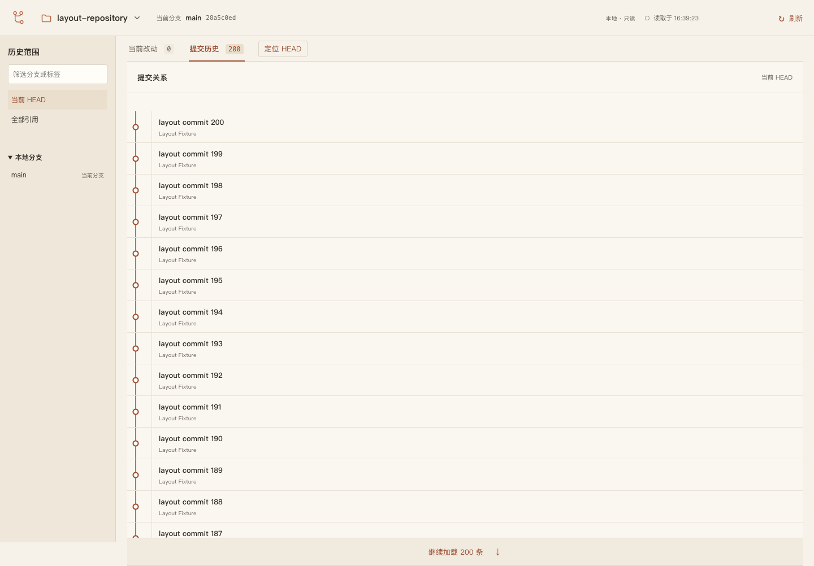
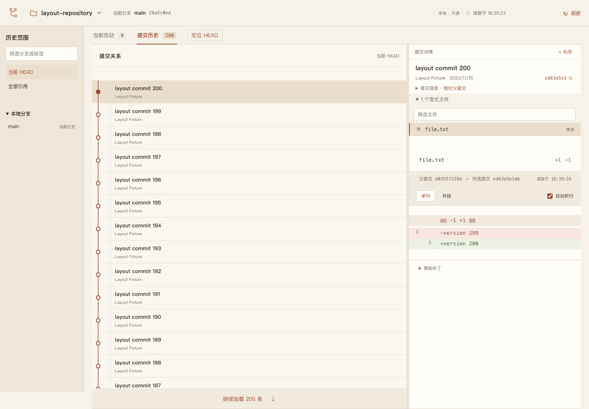
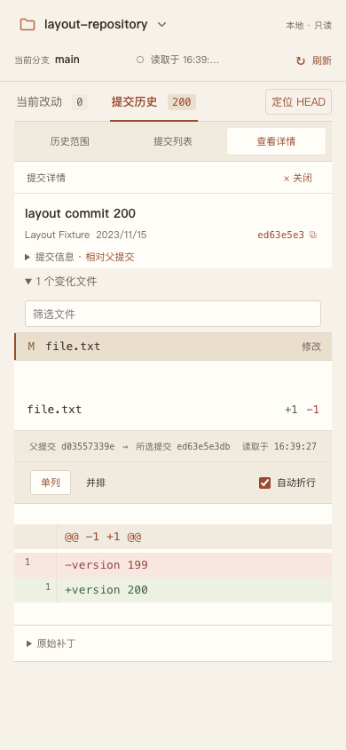

# 复杂历史阅读布局验收

日期：2026-10-06。环境：macOS Apple silicon、Chrome、Tauri 原生安装副本。

## 上传基线

改版前基线已上传到私有仓库 [XSY-28/git-view](https://github.com/XSY-28/git-view)，远端 `main` 为 `0d55958ee8110ba82f0cb95443af83248978069e`，已核对远端 SHA 与私有属性。

上传前移除了验收记录中的本机用户名、绝对主目录路径和相关文件选择器截图，提交身份使用 GitHub 用户名和 noreply 邮箱。测试仓库、构建产物、依赖和自动生成文件均不在上传范围内。本次布局修改记录在 `codex/history-reading-layout` 分支，`main` 保留改版前基线。

## 改动与边界

- 历史列表默认占满主区域，点击提交或按 Enter 才展开详情；关闭按钮与 Esc 收起详情，保留选择和列表位置。
- 详情展开后可以拖动分隔条；分隔条支持方向键、Shift、Home/End。窄窗口保持面板切换，恢复宽窗口时保留宽度偏好。
- 提交行从 66 px 缩至 56 px，标题和作者、引用组成两行；时间和完整 ID 放入悬停说明及详情。
- 保留关系图与文字独立分列、图形独立横向滚动。没有改变历史查询、排序、父子关系或分页语义，也没有折叠提交。
- 关闭详情后，迟到的提交或文件响应不能重新打开详情；切换范围或仓库会关闭详情。

借鉴的是 [Oil Git](https://github.com/oil-oil/oil-git/tree/94c0a6978b7755aab3db34a716832b181d1b3029) 的按需详情、可调分栏和紧凑列表思路。本次未运行 Oil Git 桌面版，未把源码分析等同于对其实际性能或图形清晰度的实测。

## 自动验证

| 检查 | 结果与范围 |
| --- | --- |
| 上传基线 `pnpm check` | 类型检查、128 项测试、构建通过 |
| 最终布局类型检查与构建 | TypeScript、Web 构建、macOS 桌面打包通过 |
| 完整浏览器回归 | 50 项通过，约 1.8 分钟；真实临时仓库与本地 API |
| 稳定截图复测 | 等待差异内容完成后，相关 2 项复测通过 |
| 宽图覆盖 | 32 个父分支、194 个提交；1440/390 px、纵向深处及横向两端，文字区域没有图线侵入 |
| 交互与时序 | 展开/关闭、保留选择与位置、键盘导航、分隔条、移动面板 Esc、迟到响应均通过 |
| 最终安装副本 | 7 项检查通过，见 [检查报告](history-reading-installed-checks.json) |
| 安装一致性 | 原生可执行文件及后端资源与最终构建一致，见 [哈希记录](history-reading-installed.json) |

安装检查在临时目录中运行，覆盖随包 Node、资源校验、无需外部 Node、中文与空格路径、仓库读取前后指纹不变、无效仓库错误和 stdio EOF 退出。检查报告中的 `gui: unverified` 表示该脚本不验证 GUI；下面的原生复测另行记录。

## 原生应用复测

在安装副本中打开本地完整 `git/git` 测试仓库，切换“全部引用”，确认宽列表的图形与文字分列。点击 `244dd985d3` 合并提交后加载 5 个变化文件和真实 diff；分隔条方向键使历史区域从 512 px 增至 532 px；按 Esc 后详情消失、列表恢复宽度、同一提交仍选中。

启动复测中曾遇到恢复最近仓库超时；同一安装包的 CLI 和独立 stdio 读取成功，之后重试进入原生界面成功。超时原因尚未定位，本次不声称修复了启动恢复问题。

## CI 安装问题

上传基线的 [GitHub Actions](https://github.com/XSY-28/git-view/actions/runs/37436407770) 在依赖安装阶段因 pnpm 11 拒绝未批准的 esbuild 构建脚本而失败。本地 `pnpm-workspace.yaml` 已精确允许 `esbuild@0.28.2` 的构建脚本，并在空依赖目录、空 store 的临时副本中通过 `CI=true pnpm install --frozen-lockfile` 与 esbuild 转译检查。

此修复与布局调整在同一分支交付。上述结果是本地验证，远端 CI 的结果应以该分支对应的 GitHub Actions 运行为准。

## 后续调整：详情收起时缩窄文字列

根据实际使用反馈，详情收起时将文字列预留宽度设为容器宽度的 35%，限制在 220–360 px；关系图使用剩余宽度。简单图仍按实际图宽布局，详情展开时沿用原有比例。长标题继续省略显示并保留完整悬停说明。

本次类型检查、Web/桌面构建通过；宽图双轴滚动、详情展开关闭及键盘定位、窄窗口切换共 3 项浏览器回归通过（13.8 秒）。宽图测试调整为 64 个分支各 3 个提交，仍为 194 条，保证在更宽的图形区域下仍覆盖横向滚动。新安装副本与构建的校验值见 [安装记录](history-compact-copy-installed.json)。在原生应用中重新打开 `git/git` 并切换全部引用，已目视确认文字列缩窄、图形区域扩大。

## 截图

下方截图记录的是上述文字列缩窄之前的版本。

截图使用不含本机用户名和私人路径的临时测试数据，不是 Oil Git 或原生 `git/git` 的截图。

