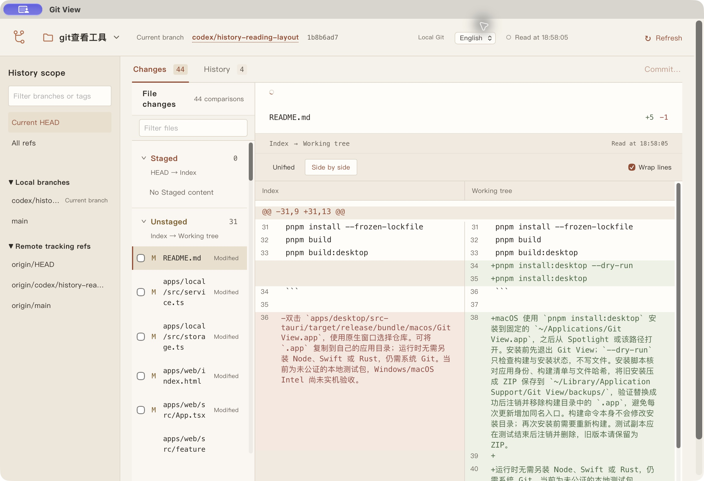
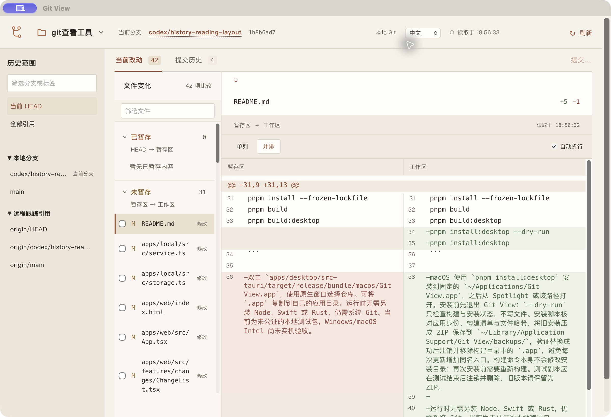

# 中英文界面与语言持久化验收

日期：2026-10-06。环境：macOS Apple silicon、Node 24.19.0、Chrome、Tauri 原生安装副本。

## 行为

- 未设置语言时使用英文，顶部选择器提供 English 和中文。
- 主界面、仓库导航、历史与差异、读取反馈、提交与分支表单、操作确认及应用错误提示随选择更新。日期格式与页面语言属性同步更新。
- 仓库名、分支名、路径、提交说明、文件内容、原始补丁和 Git 诊断保留原文。
- 设置保存到应用数据目录中的 `preferences.json`，默认目录为 `~/.local/share/git-view`，可由 `GIT_VIEW_HOME` 指定。它是应用级设置，不属于某个仓库。
- 桌面 stdio 和浏览器 HTTP 入口共用设置存储。重新启动本地进程即使端口变化，也能恢复最后一次保存的语言。
- 保存使用序列化的原子文件替换；收到成功回执后才更新界面。保存失败显示提示并保留原语言。设置文件缺失、格式损坏或版本不兼容时默认英文，不覆盖原文件。

## 自动验证

| 检查 | 结果 |
| --- | --- |
| `pnpm typecheck` | 通过 |
| `pnpm test` | 27 个测试文件、190 项测试通过 |
| 设置与翻译定向复测 | 9 项通过 |
| `pnpm build` | 通过 |
| `pnpm test:e2e` | 最终串行执行 67 项通过，2.8 分钟 |
| `pnpm build:desktop` | 通过 |
| `pnpm install:desktop --dry-run` 与实际安装 | 通过；旧安装保存为 ZIP，构建目录的重复应用副本已移除 |

新增浏览器场景使用真实临时仓库，覆盖默认英文、中英文切换、筛选与选择保留、并排视图保留、刷新页面、关闭后打开新页面、重启本地进程并使用全新浏览器上下文恢复中文，以及再次选择英文后的重启恢复。还覆盖英文操作预览、保存失败提示与重试、390 px 窄窗口和仓库 HEAD/index 不变。

现有浏览器交互测试明确设置中文；受控时序模拟接口也增加了设置读取响应。第一次全量执行发现旧模拟接口没有处理该请求，修正后相关 12 项通过。期间并行运行测试曾导致共享输出目录的 trace 文件冲突；最终全量验收采用单次串行执行，67 项全部通过。

## 原生验证

已更新固定安装路径 `~/Applications/Git View.app`。安装构建时间为 2026-10-06 18:54:22（北京时间），安装后应用指纹为：

```text
0f72837cab8ca8e30415946f59a8d6dc27d63877b4ae94ce6e9c3208d1b985aa
```

使用独立临时应用数据目录启动该安装副本，目视及无障碍树确认初始为英文。选择中文后退出，再使用同一数据目录重新启动，确认选择器保持中文，主视图、历史范围和文件比较标签均为中文；设置文件保存 `language: zh-CN`。再切回英文，确认界面恢复英文且设置文件保存 `language: en`。

原生证据覆盖英文默认、双向切换和中文退出重开恢复；英文的进程重启恢复由上述浏览器真实宿主测试覆盖。Windows 与 macOS Intel 未实机验证。




