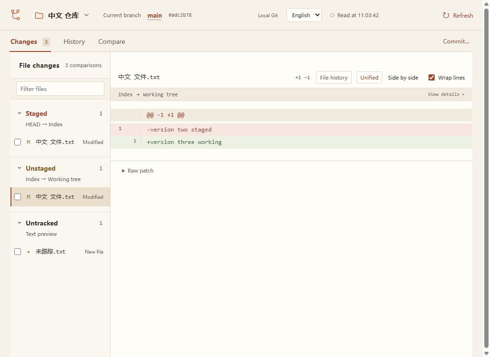
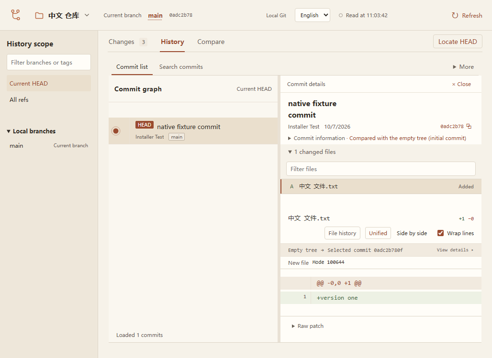

# 桌面安装包验收（2026-10-07）

本轮为桌面预览版 0.2.0 提供 macOS Apple silicon DMG 和 Windows x64 NSIS EXE。构建源码为 `727be42df4ed0fcecb69d38348d61dd1831e02ef`，安装步骤见[安装说明](../INSTALL.md)。安装包没有 Developer ID、公证或 Windows 代码签名。

## 已验证

| 项目 | 结果与证据 |
| --- | --- |
| 本机源码检查 | `pnpm check` 通过：232 个测试、32 个文件，以及类型检查和构建。 |
| 本机宿主检查 | `cargo test --locked` 的 4 个实际 sidecar 生命周期测试通过，包括正常退出、协议错误、崩溃重启和 Git 子进程回收。 |
| macOS 安装与恢复脚本 | `pnpm test:install-desktop` 的 27 个测试通过。 |
| 本地 macOS DMG | 完整性、挂载、包内安装程序真实 dry-run 及解压内容验证通过；实际安装到 `~/Applications/Git View.app`。 |
| 本机 macOS 原生窗口 | 暂存差异显示 `-version one / +version two staged`，工作区差异显示 `-version two staged / +version three working`，首次提交显示 `+version one`；正常退出后主进程与 Node 子进程均结束。 |
| macOS 清理 | 用既有安装脚本移除本轮原始构建副本；旧版本保存为 ZIP，注册唯一检查及搜索服务刷新通过。最近打开的仓库恢复为项目目录，测试临时仓库已移除。 |
| 云端 macOS 包 | [打包运行](https://github.com/XSY-28/git-view/actions/runs/37610447140)的 macOS job 成功。CI 包验证报告与本机同源码构建的 DMG 原生窗口走查是分别记录的证据。 |
| Windows 安装与窗口 | 真实 NSIS 安装到中文/空格目录、包内运行、打开中文仓库、暂存/工作区差异、历史、仓库只读指纹、后台 Node 无控制台、正常关闭与子进程回收、卸载全部通过，见同一打包运行的 Windows job 与随包两份验证报告。 |

本地 DMG 的 SHA256 为 `42708befe15e289747273e4bb92c694c6e33c0b6062e2eba4bc8398a00b6b49c`。安装后的原生可执行文件和资源哈希，与从该 DMG 解压验证的内容一致。本地验收报告保存在忽略的 `dist/installers/`，CI 的平台包与报告保存在对应工作流 Artifacts。

## Windows 问题与回归检查

最初的安装包可完成构建、NSIS 安装和包内 CLI / stdio 验证，但原生窗口测试未能接入 WebView2。进程诊断和桌面截图确认窗口、WebView2 与 Node 已运行；WebView2 命令行缺少测试请求的调试参数。

微软文档明确指出，[管理员宿主会忽略环境变量中的 WebView2 调试参数](https://learn.microsoft.com/en-us/microsoft-edge/webview2/concepts/webview-features-flags)。验证脚本在一次性 CI 机器中仅为 `git-view-desktop.exe` 设置对应 HKLM 参数，保留并在 `finally` 中恢复旧值。应用的正常启动没有调试端口配置。

截图同时暴露了后台 Node 额外分配控制台窗口的问题。[旧包回归运行](https://github.com/XSY-28/git-view/actions/runs/37610032540)在实际进程控制台检查中失败。修复在 Windows 宿主中以 `CREATE_NO_WINDOW` 启动后台 Node，并为 Node 发起的 Git 查询设置 `windowsHide`；保留原有管道通信和 Windows Job 退出清理机制。新包已通过同一进程检查及完整窗口走查。

Windows 安装包的 SHA256 为 `ea2cfd34635e5fc47a447bc62fa439822104cf31b6bc8b9da98b436ec0e8cb37`，下载到本机后已与随包校验文件核对。CLI 验证报告中的 `gui: unverified` 只表示 CLI 脚本不执行 GUI 检查；原生窗口的独立报告列出上述窗口检查全部通过。

## 验证边界

- Windows 仍只支持查看，暂存、取消暂存、提交与分支写入尚未开放。
- Windows CI 环境中的实际窗口验证不等于所有 Windows 10/11 实体电脑验收；人工安装向导、原生目录选择器与 SmartScreen 仍需目标设备复测。
- macOS 首次互联网下载后的 Gatekeeper 流程、不同 macOS 版本及 Spotlight 搜索面板尚未复测。注册唯一、搜索服务刷新和新 PID 不能替代搜索面板证据。
- 暂无 Intel Mac、Windows ARM 和 Linux 安装包，也没有自动更新机制。
