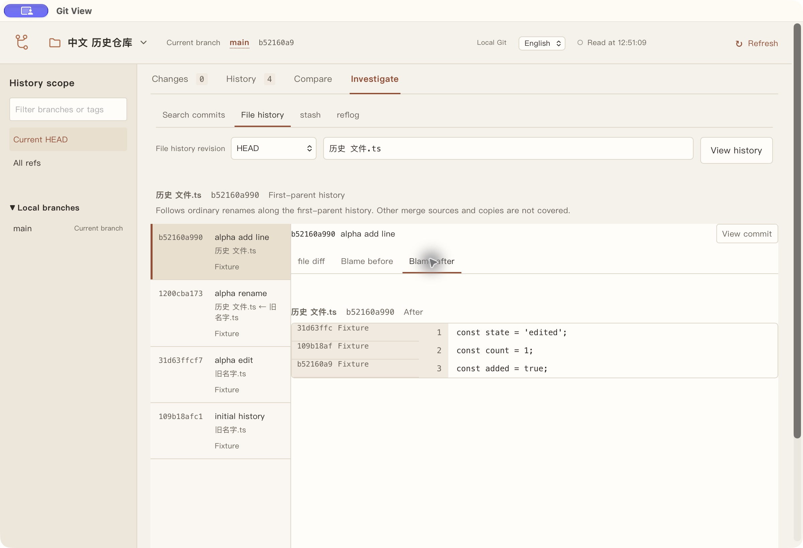

# 第五批：历史调查验证

日期：2026-10-07；macOS Apple silicon。范围为提交搜索、文件历史、行来源、stash/reflog 查看；不包括任务基线、上游 ahead/behind 和新的写操作。

## 自动化证据

| 检查 | 本次结果 |
| --- | --- |
| TypeScript 类型检查 | 最终代码通过 |
| 全部源码测试 | 发布前对最终源码完整复核：31 个文件、223 项通过 |
| 新增真实 Git 调查测试 | 13 项通过，均使用独立临时仓库 |
| 完整浏览器回归 | 发布前对最终构建完整复核：76 项通过 |
| macOS 安装与恢复单元测试 | 27 项通过；系统注册与搜索操作使用替身 |

发布前 `pnpm check` 同时完成类型检查、源码测试及 Web/CLI/stdio 构建；README 的公开本地链接与 GitHub Markdown 渲染也已检查。以下原生安装与窗口记录保留其独立验收范围。

真实 Git 测试覆盖字面标题/作者/ID/路径查询、固定 tips 分页、分支移动、普通重命名、第一父合并差异、两侧行号与来源、原始作者及 `.mailmap`、三个 stash 快照、原始 reflog old/new OID、记录追加后的身份、缺失对象、linked worktree 的 HEAD 日志、浅历史和数量/输出上限。包含空格、制表符、换行、中文与 emoji 路径，以及删除文件比较前的内容。外部 clean/process、textconv、diff 探针启用后，固定对象读取仍成功，仓库指纹保持不变。

core 验证观测/条目授权、游标筛选、会话与 worktree 隔离、generation 刷新和写入失效；迟到文件历史成功或错误不能重新授权旧详情。stash 文件只能来自当前会话已读取的实际快照清单。搜索和行来源打开提交时，即使存在 refs/replace，也展示对应的原始对象。

浏览器流程覆盖搜索字段和分页、结果进入提交详情和文件历史、重命名两侧行来源、键盘选择、已加载页数与选择保留、stash 工作区/暂存/未跟踪切换、reflog 两端进入已有版本比较。延迟真实响应的成功/错误及切换侧后的旧 blame 均被拒绝；取消/重读、中英切换和 390px 窄窗口通过。旧暂存、提交、分支、历史、差异和版本比较测试全部保留。

## 固定安装版验收

通过 `pnpm update:desktop` 构建并安装到 `~/Applications/Git View.app`，不复制测试应用。安装脚本保存旧版 ZIP、清理构建副本、核对注册唯一并刷新当前用户的搜索服务。

安装版资源哈希核对通过。限制 PATH 为 `/usr/bin:/bin`，使用包内 Node v24.19.0 的 CLI 成功查询带中文、空格的临时仓库；查询前后指纹不变。

实际原生窗口已完成：标题搜索 → 提交详情 → 差异中的文件历史入口，重命名记录的前后路径及原始行来源，新增行对应的新提交，stash 工作区/暂存区/未跟踪三个真实快照，以及 reflog 记录 old → new 进入版本比较。查看结束后 refs/index/工作文件的完整指纹与进入前一致；应用退出，临时仓库与隔离应用状态由 `finally` 清理。

走查发现的搜索范围漏译和未跟踪快照空树标签已补齐。最终安装版原生窗口复测显示 `All refs`、`Empty tree`，并重新读取文件历史和三行真实行来源；最后一轮资源哈希、独立 Node CLI 和查看前后指纹核对再次通过。未遗留应用或包内 Node 查询子进程。

最终构建时间 `2026-10-07T04:49:10.567Z`；安装指纹 `4e4244afc155bf6ba87ca21953041565c3f8efbdb3c6a6fdae87ab2acafb7fa8`。本次迭代均由统一更新脚本完成，旧版保存为 ZIP，本次构建 `.app` 已清理。

Spotlight 搜索结果仍未验证。安装脚本确认注册唯一并刷新 `com.apple.campo`，但原生自动化只取得 Siri 窗口，快捷键未取得正常搜索面板；旧 Spotlight 应用入口启动失败。因此不能据此判断搜索结果已恢复，也不声称永久去重。

## 验证边界

文件历史为第一父链普通重命名范围；行来源支持已提交的普通 UTF-8 文本，沿用 1 MiB/10,000 行限制。reflog 仅支持 files 引用存储；reftable 和其他平台的原生窗口未实机验证。对象清理、观测淘汰或浅边界变化均可能使详情失效，不自动下载或拿工作区内容替代。

设计与预算见[历史调查决策](../decisions/0004-history-investigation.md)。测试数字是本次本机结果，不代表尚未运行的远程 CI 或跨平台验收。
